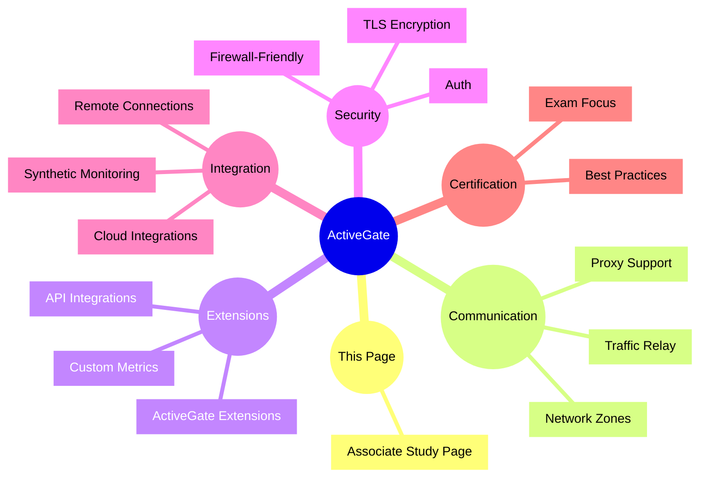

# Dynatrace ActiveGate

## Overview

The Dynatrace ActiveGate component acts as a secure communication and extension gateway for Dynatrace. For the DynaTrace Associate certification, ActiveGate is important because it enables remote monitoring, proxying, and extension hosting across network zones.

## ActiveGate Mindmap

## Key Concepts

- **ActiveGate**: A relay and extension host that enables secure communication between Dynatrace clusters, OneAgents, and external systems.
- **Network Zone**: A grouping of monitored entities that use ActiveGate to communicate across network boundaries.
- **Proxy support**: ActiveGate allows Dynatrace traffic to traverse proxy servers and isolated network segments.
- **Extension host**: ActiveGate can run custom monitoring extensions and integrations.
- **Remote monitoring**: ActiveGate supports monitoring of remote environments that cannot connect directly to Dynatrace.

## Main Features

### Secure traffic relay
- Acts as a secure communication hub between OneAgent and Dynatrace.
- Enables traffic relay across firewalls and network zones.
- Supports TLS encryption and authentication for secure data transfer.

### Proxy and firewall support
- Works with HTTP/HTTPS proxies and restricted network environments.
- Helps bridge isolated network segments to the Dynatrace cluster.
- Ensures reliable connectivity for remote hosts.

### Extension runtime
- Hosts ActiveGate extensions for custom monitoring logic.
- Supports plugins for APIs, infrastructure, and specialized systems.
- Enables credential and secret handling for extension access.

### Synthetic and cloud integration
- Supports synthetic monitoring traffic from remote locations.
- Integrates with cloud provider APIs and services through extensions.
- Enables hybrid monitoring scenarios across on-premises and cloud environments.

## Typical Uses for the Associate Certification

- Understanding how Dynatrace extends monitoring beyond direct OneAgent connections.
- Recognizing the role of ActiveGate in secure, proxy-friendly communication.
- Knowing how ActiveGate supports extensions and remote environment access.
- Explaining how network zones and ActiveGate relate to distributed monitoring.
- Using ActiveGate to enable hybrid and multi-cloud monitoring.

## Exam-Relevant Focus

- Know that ActiveGate is used for secure relay, proxy support, and remote monitoring.
- Understand that ActiveGate can run extensions to collect custom metrics and integrate with external systems.
- Be able to explain the concept of network zones and why ActiveGate is required for them.
- Remember that ActiveGate improves connectivity in restricted or isolated environments.

## Best Practices

- Deploy ActiveGate in each network zone or isolated segment that needs Dynatrace connectivity.
- Monitor ActiveGate health and ensure it is reachable by OneAgents and Dynatrace.
- Use ActiveGate for proxy-enabled and firewall-restricted environments.
- Keep ActiveGate extensions updated and secure.

## Summary

Dynatrace ActiveGate is the gateway component that enables secure, remote, and extension-based observability. For Associate certification, it is the key to understanding how Dynatrace monitors across network boundaries and supports advanced integration scenarios.