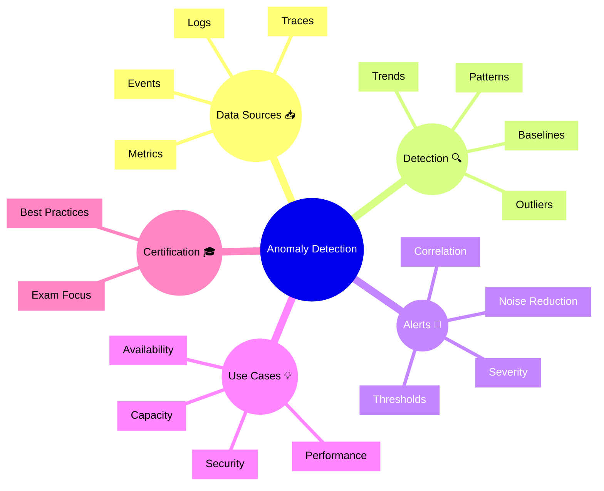

# Dynatrace Anomaly Detection

## Overview

Dynatrace Anomaly Detection identifies unusual patterns in metrics, logs, and events. In the DynaTrace Associate certification context, it is core to understanding how the platform uses baselines and AI to detect issues early.

## Anomaly Detection Mindmap

## Key Concepts

- **Anomaly Detection**: Automatic identification of metric, log, or event behavior that deviates from normal.
- **Baseline**: The expected normal behavior learned from historical data.
- **Outlier**: A value or pattern that differs significantly from the baseline.
- **Noise Reduction**: Techniques to reduce false positives.
- **Correlation**: Linking anomalies to related services or incidents.

## Main Features

### Baseline-Based Detection
- Learns normal behavior from historical data.
- Detects deviations without manual threshold tuning.
- Offers dynamic alerting for changing environments.

### Multi-Source Monitoring
- Applies anomaly detection to metrics, logs, and event streams.
- Detects issues across infrastructure, applications, and services.
- Identifies patterns that might be missed by static rules.

### Alerting and Correlation
- Alerts on atypical behavior or sudden changes.
- Correlates anomalies with related problems and root causes.
- Supports faster investigation through linked context.

### Reduced Noise
- Uses statistical models to reduce false alerts.
- Supports tuning sensitivity for more accurate detection.
- Focuses on actionable deviations rather than normal fluctuation.

## Typical Uses for the Associate Certification

- Understanding how Dynatrace detects issues automatically.
- Recognizing the role of baselines and historical data.
- Learning why anomaly detection is useful in dynamic cloud environments.
- Seeing how anomalies relate to problems and alerts.

## Exam-Relevant Focus

- Know that anomaly detection is based on learned baselines.
- Understand that it detects deviations in metrics, logs, and events.
- Be able to explain the benefits of noise reduction and correlation.
- Remember that anomaly detection supports proactive issue discovery.

## Best Practices

- Use anomaly detection for dynamic and cloud-native environments.
- Tune sensitivity to reduce false positives while catching real issues.
- Link anomalies to problems and services for faster action.
- Monitor trends to validate that detection is improving.

## Summary

Dynatrace Anomaly Detection identifies unusual behavior across observability data. For Associate certification, it emphasizes proactive monitoring, AI-driven baselines, and early issue detection.
