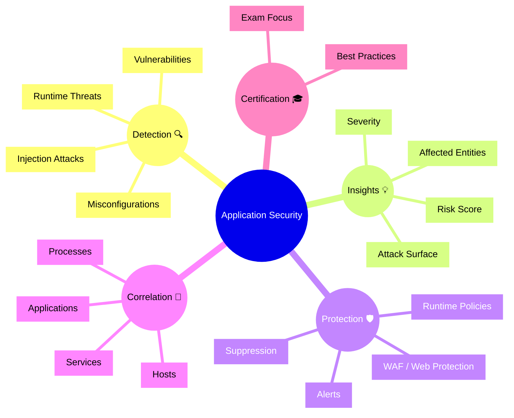

# Dynatrace Application Security

## Overview

The Dynatrace Application Security app provides visibility into application vulnerabilities, runtime threats, and compliance risks. In the context of the DynaTrace Associate certification, this app is important because it demonstrates how security issues are discovered, prioritized, and correlated with application behavior and infrastructure health.

## Application Security Mindmap

## Key Concepts

- **Application Security**: Monitoring and protecting applications from vulnerabilities and runtime threats.
- **Runtime Threats**: Active attacks or malicious behavior observed while the application is running.
- **Vulnerability**: A code, library, or configuration weakness that could be exploited by an attacker.
- **Risk Score**: A calculated value that prioritizes security issues based on severity and impact.
- **Attack Surface**: The set of application components, endpoints, and services exposed to risk.

## Main Features

### Threat Detection and Vulnerability Scanning
- Identifies runtime threats, suspicious requests, and exploitation attempts.
- Detects vulnerabilities in application code, third-party libraries, and configuration.
- Reports threats and vulnerabilities with severity and risk context.

### Security Insights and Prioritization
- Shows risk scores, affected entities, and severity levels for each finding.
- Highlights the application components and services impacted by security issues.
- Helps prioritize remediation based on both security risk and application impact.

### Runtime Protection and Policies
- Supports runtime policies to block or monitor suspicious activity.
- Integrates with web application protection features for common attack classes.
- Allows tuning and suppression of findings based on known safe exceptions.

### Correlation with Application Context
- Links security issues to services, hosts, processes, and application components.
- Provides end-to-end context so security findings are not isolated from performance or availability issues.
- Enables faster investigation by showing where a threat intersects with application health.

### Dashboards and Reporting
- Displays security dashboards for vulnerabilities, threats, and compliance.
- Supports filtering by severity, risk score, application, and environment.
- Provides summary views suitable for security teams and operations teams.

## Typical Uses for the Associate Certification

- Understanding how Dynatrace discovers runtime threats and vulnerabilities.
- Recognizing how application security findings are prioritized and scored.
- Learning how security issues are correlated with services and infrastructure.
- Knowing which security metrics and alerts are most relevant to application stability.
- Using the app to identify high-risk application components quickly.

## Exam-Relevant Focus

- Know that Dynatrace Application Security focuses on runtime threats and vulnerabilities.
- Understand the meaning of risk score, severity, and attack surface.
- Be able to describe how security findings are linked to application entities.
- Recognize the value of prioritizing security issues by impact and risk.
- Remember that protection and correlation are key to effective security monitoring.

## Best Practices

- Check security dashboards regularly for new vulnerabilities and runtime threats.
- Use risk score and severity to focus on the most critical findings.
- Correlate security issues with services and infrastructure health before remediation.
- Tune runtime policies to reduce false positives while maintaining protection.
- Keep security context visible in incident response and root cause analysis.

## Summary

The Dynatrace Application Security app helps secure applications by surfacing runtime threats, vulnerabilities, and risk context. For the DynaTrace Associate certification, it highlights how security monitoring is integrated into the broader observability platform and how security findings are prioritized and correlated with application health.
