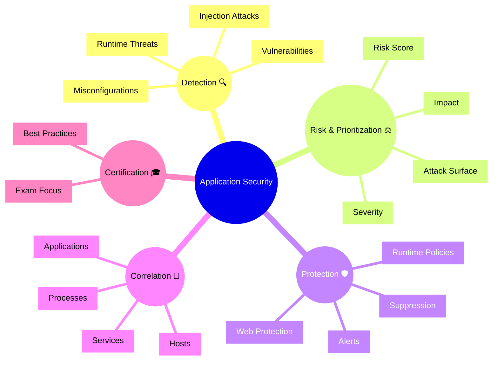

# Dynatrace Application Security Flashcards

## Overview

These flashcards cover key concepts for Dynatrace Application Security in the context of the DynaTrace Associate certification. They include Mermaid diagrams and iconic descriptions to help memorize how security is integrated into Dynatrace observability.

## Application Security Mindmap

## Flashcards

### Q: What is Dynatrace Application Security? 🛡️
A: The monitoring and protection layer that identifies vulnerabilities, runtime threats, and configuration risks in applications and their runtime environment.

### Q: What are runtime threats? 🔥
A: Active attacks or unusual behavior detected while the application is running, such as injection attempts or suspicious requests.

### Q: What is a vulnerability in Dynatrace Application Security? 🧨
A: A weakness in code, libraries, or configuration that could be exploited by attackers.

### Q: What does risk score represent? 📊
A: A calculated priority based on severity and impact that helps teams focus on the highest-risk security findings.

### Q: What is attack surface? 🌐
A: The set of exposed application components, endpoints, and services that are vulnerable to threats.

### Q: What is the difference between detection and protection? 🚨
A: Detection finds security issues and threats, while protection uses policies and controls to block or mitigate suspicious activity.

### Q: What is a runtime policy? 📜
A: A rule that governs how suspicious activity is handled at runtime, including logging, blocking, or alerting.

### Q: How does Dynatrace correlate security issues? 🔗
A: It links security findings to services, hosts, processes, and applications to provide context and faster root cause analysis.

### Q: What is the purpose of severity levels in security findings? ⚠️
A: To classify how urgent an issue is, helping identify whether it requires immediate attention or can be handled later.

### Q: What is a common best practice for application security review? ✅
A: Prioritize findings by risk score and impact, then correlate them with application entities before remediating.

### Q: Why are security dashboards useful? 📈
A: They provide a summary of vulnerabilities, threats, and compliance status for security and operations teams.

### Q: What is an iconic description of security correlation? 🔗
A: `Correlation 🔗` because it shows the connection between security events and application/system entities.

### Q: What is the role of alerts in application security? 📣
A: Alerts notify teams of new or critical security issues so they can act before problems escalate.

### Q: What is suppression used for in security monitoring? 🧯
A: Hiding or de-prioritizing known safe issues to reduce noise while keeping the finding documented.

### Q: What should Associate candidates remember about Application Security? 🎓
A: It combines threat detection, vulnerability insight, risk prioritization, and correlation with application health.
