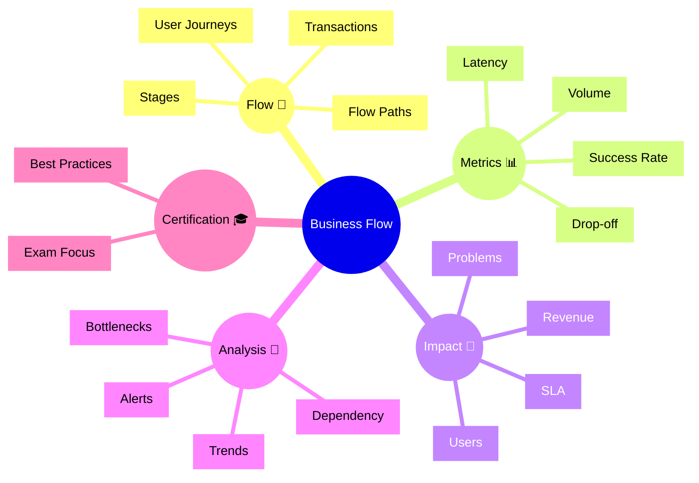

# Dynatrace Business Flow

## Overview

The Dynatrace Business Flow app visualizes how business transactions and processes flow through the application stack. For the DynaTrace Associate certification, this app is important because it shows how business-critical flows are connected to application performance and user impact.

## Business Flow Mindmap

## Key Concepts

- **Business Flow**: The visualization of business processes and transactions across systems.
- **Transaction**: A business activity or customer interaction tracked through the application.
- **Journey**: The sequence of steps a user or transaction takes.
- **Drop-off**: The point where business transactions fail or stop.
- **Business Impact**: The effect of performance and failures on users, revenue, or SLAs.

## Main Features

### Transaction Visibility
- Maps business transactions from initiation to completion.
- Displays transaction volume, success rate, and latency.
- Helps spot underperforming business flows.

### User Journey Tracking
- Follows user paths through the application.
- Identifies stages where users abandon or fail.
- Supports optimization of customer experience.

### Impact and Prioritization
- Links business flow metrics to users, revenue, and SLAs.
- Helps prioritize issues with the highest business impact.
- Shows how performance problems affect key transactions.

### Root Cause and Alerts
- Uses flow analysis to identify bottlenecks and problem areas.
- Supports alerts for significant business flow degradation.
- Helps teams focus on transactions that matter most.

## Typical Uses for the Associate Certification

- Understanding how Dynatrace visualizes business transactions.
- Recognizing why business flow visibility matters for user impact.
- Learning how transaction metrics are used to prioritize problems.
- Using Business Flow to correlate customer journeys with performance issues.

## Exam-Relevant Focus

- Know that Business Flow focuses on business transaction visibility and impact.
- Understand what drop-off, latency, and success rate mean for flows.
- Be able to explain how business metrics map to application health.
- Remember that business flow helps connect technical problems to user outcomes.

## Best Practices

- Use business flow views to identify the highest-impact issues.
- Monitor flow metrics alongside service and problem data.
- Focus remediation on stages with high drop-off or latency.
- Share business flow insights with stakeholders and operations teams.

## Summary

The Dynatrace Business Flow app helps teams understand how business-critical transactions perform. For Associate certification, it emphasizes the connection between user journeys, metrics, and business impact.
