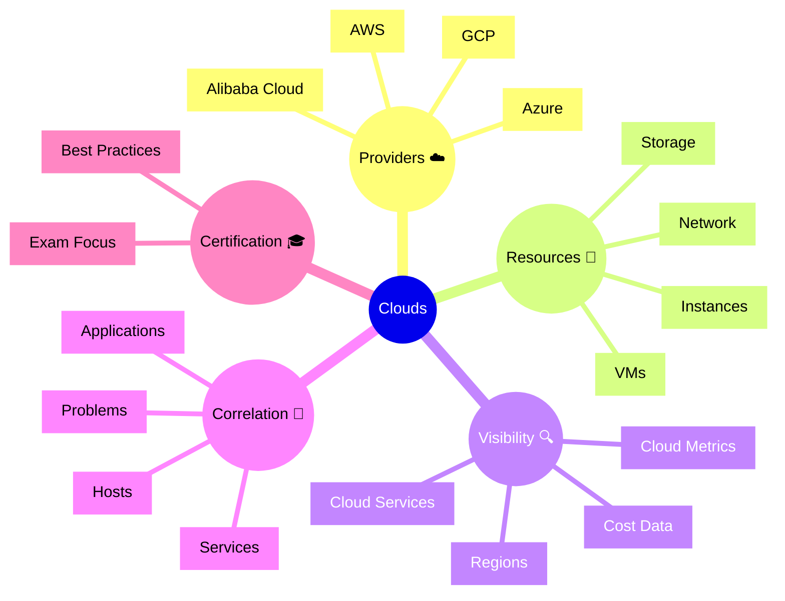

# Dynatrace Clouds

## Overview

The Dynatrace Clouds app provides visibility into cloud provider resources, services, and regions. For the DynaTrace Associate certification, this app is key because it shows how Dynatrace monitors cloud environments and links cloud entities to application health.

## Clouds Mindmap

## Key Concepts

- **Clouds**: A Dynatrace view of cloud provider infrastructure and service metadata.
- **Provider**: A cloud vendor such as AWS, Azure, or GCP.
- **Cloud entity**: A resource like a VM, storage account, or managed service.
- **Region**: The geographic location of cloud resources.
- **Cloud correlation**: Associating cloud resources with monitored applications and services.

## Main Features

### Cloud Resource Discovery
- Detects cloud provider resources and services from linked accounts.
- Displays VMs, instances, storage, networking, and managed services.
- Shows cloud entity metadata including regions and tags.

### Provider Visibility
- Supports multi-cloud environments with AWS, Azure, GCP, and more.
- Presents cloud inventory by provider, region, and resource type.
- Helps identify cloud infrastructure dependencies.

### Cloud Metrics and Health
- Displays health and performance data for cloud resources.
- Includes cloud-specific metrics like VM status, service availability, and network usage.
- Highlights cloud resource issues affecting applications.

### Application Correlation
- Links cloud entities to hosts, services, and applications.
- Helps identify which cloud resources support critical business applications.
- Supports cloud incident analysis and root cause investigation.

## Typical Uses for the Associate Certification

- Understanding how Dynatrace discovers and organizes cloud resources.
- Recognizing which cloud providers and services are monitored.
- Learning how cloud entity data is correlated with application health.
- Using the Clouds app to identify cloud-related causes of performance issues.

## Exam-Relevant Focus

- Know that Clouds provides multi-cloud inventory and monitoring.
- Understand how cloud resource tags and regions help organize data.
- Be able to explain how cloud resources map to applications and services.
- Remember that cloud health is part of the broader observability picture.

## Best Practices

- Review cloud inventory regularly to understand environment scope.
- Use provider and region filters to isolate cloud issues.
- Correlate cloud problems with service and application impact.
- Keep cloud account integrations and permissions up to date.

## Summary

The Dynatrace Clouds app offers a cloud-focused view of infrastructure resources and service dependencies. For Associate certification, it emphasizes cloud discovery, provider visibility, and cloud-to-application correlation.
