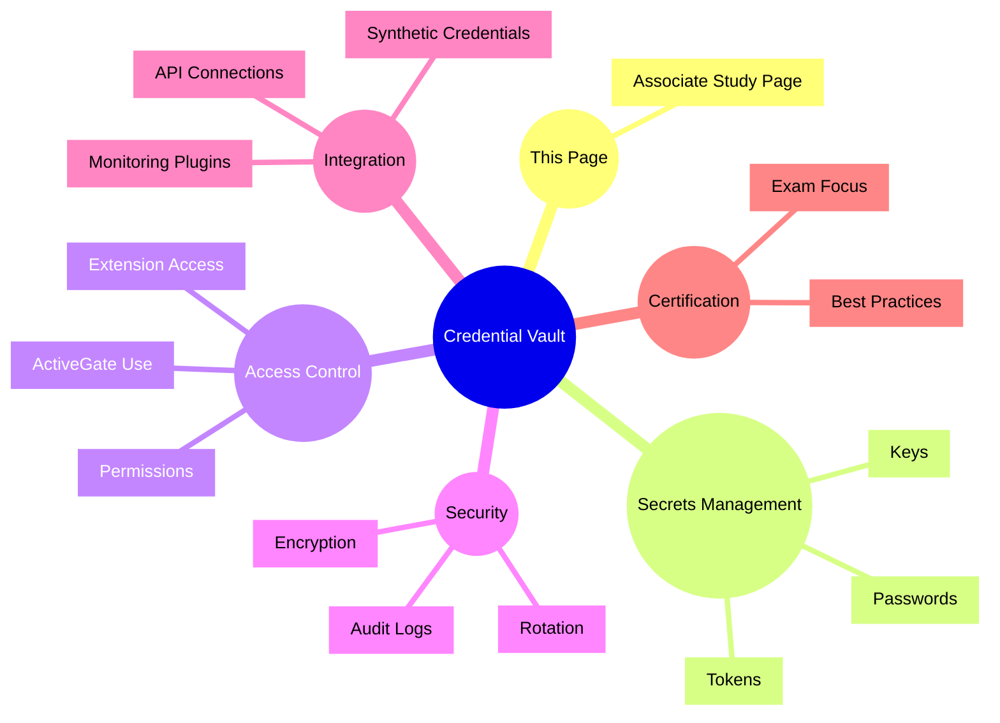

# Dynatrace Credential Vault

## Overview

The Dynatrace Credential Vault secures secrets and credentials used by Dynatrace extensions and integrations. For the DynaTrace Associate certification, Credential Vault is important because it protects sensitive access data and enables secure extension-based monitoring.

## Credential Vault Mindmap

## Key Concepts

- **Credential Vault**: Secure storage for secrets used by Dynatrace extensions, ActiveGate components, and integrations.
- **Secret management**: The practice of storing credentials, tokens, and API keys securely.
- **Extension access**: Credential Vault provides safe access for ActiveGate extensions that need external system credentials.
- **Encryption and audit**: Secrets are encrypted and access is auditable to meet security requirements.
- **Credential rotation**: Vaulted credentials should be rotated regularly to reduce risk.

## Main Features

### Secure secret storage
- Stores passwords, keys, and tokens in encrypted form.
- Prevents hard-coded credentials in extensions or scripts.
- Enables secure retrieval only by authorized Dynatrace components.

### Extension credential access
- Supplies credentials to ActiveGate extensions and plugins.
- Supports integrations that need access to external systems.
- Keeps secrets separate from extension configuration.

### Audit and compliance
- Tracks access to vaulted credentials.
- Provides audit trails for security review.
- Supports compliance and governance needs.

### Credential lifecycle
- Enables credential rotation and replacement.
- Reduces exposure from stale or compromised secrets.
- Works with secure deployment pipelines and approval workflows.

## Typical Uses for the Associate Certification

- Understanding how Dynatrace protects sensitive credentials used by integrations.
- Recognizing the role of Credential Vault in secure extension operations.
- Knowing why credential rotation and audit trails matter.
- Explaining how secrets are accessed by ActiveGate and Dynatrace plugins.
- Using Credential Vault to support secure observability practice.

## Exam-Relevant Focus

- Know that Credential Vault stores secrets securely for Dynatrace extensions and integrations.
- Understand that ActiveGate extensions access vaulted credentials without exposing raw secrets.
- Be able to explain why encryption, audit, and rotation are important for credential security.
- Remember that the Credential Vault helps keep Dynatrace integrations secure.

## Best Practices

- Store only approved secrets in Credential Vault and avoid embedding credentials in code.
- Enable auditing to track secret use and access.
- Rotate credentials regularly to minimize security risk.
- Use Credential Vault for extension and integration credentials whenever available.

## Summary

Dynatrace Credential Vault enables secure secret management for extensions, ActiveGate, and integration use cases. For Associate certification, it reinforces the importance of secure observability and credential best practices.