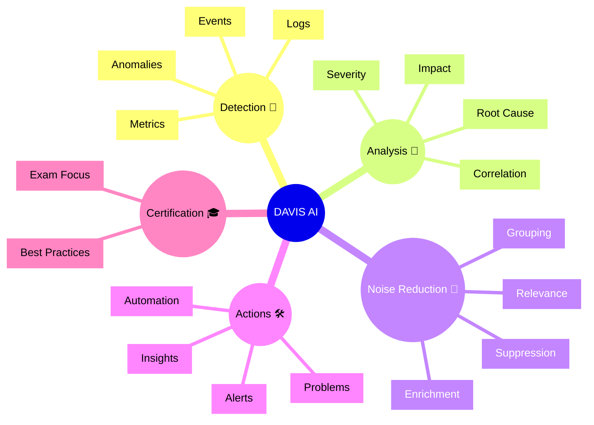

# Dynatrace DAVIS AI

## Overview

DAVIS AI is Dynatrace’s artificial intelligence engine that detects anomalies, identifies root causes, and reduces alert noise. In the DynaTrace Associate certification context, DAVIS AI is important because it shows how smart analysis works across metrics, logs, traces, and events.

## DAVIS AI Mindmap

## Key Concepts

- **DAVIS AI**: Dynatrace’s AI engine that analyzes telemetry and surfaces meaningful problems.
- **Anomaly Detection**: Identifying unusual behavior in metrics, logs, or traces.
- **Root Cause**: The most likely source of a problem identified by DAVIS AI.
- **Noise Reduction**: Grouping related alerts and filtering low-value signals.
- **Impact Analysis**: Evaluating the scope of affected entities and users.

## Main Features

### Intelligent Problem Detection
- Uses machine learning to detect performance anomalies and failures.
- Automatically groups related symptoms into problems.
- Reduces alert noise by correlating telemetry across domains.

### Root Cause Identification
- Finds likely root causes by analyzing dependencies and behavior.
- Connects metrics, logs, traces, and events to a single issue.
- Helps shorten troubleshooting time.

### Problem Prioritization
- Scores issues by severity and impact.
- Highlights the most significant problems first.
- Supports operator decision-making through clear insights.

### Automated Insights
- Provides AI-driven insights and recommendations.
- Generates problem descriptions, affected entities, and potential causes.
- Integrates with alerts, dashboards, and workflows.

## Typical Uses for the Associate Certification

- Understanding how DAVIS AI detects anomalies across observability data.
- Recognizing the value of automated root cause analysis.
- Learning how AI groups related signals into meaningful problems.
- Knowing how impact and severity help prioritize responses.

## Exam-Relevant Focus

- Know that DAVIS AI is the core intelligence behind Dynatrace problem detection.
- Understand the difference between raw metrics and AI-detected problems.
- Be able to explain how noise reduction improves alert quality.
- Remember that DAVIS AI correlates data across metrics, logs, traces, and events.

## Best Practices

- Trust DAVIS AI for initial problem detection and correlation.
- Review AI insights before escalating investigation.
- Use noise reduction features to focus on high-value problems.
- Validate AI-suggested root causes with supporting data.

## Summary

DAVIS AI is the smart engine that makes Dynatrace observability actionable. For Associate certification, it highlights how AI-driven problem detection, root cause analysis, and noise reduction improve operational efficiency.
