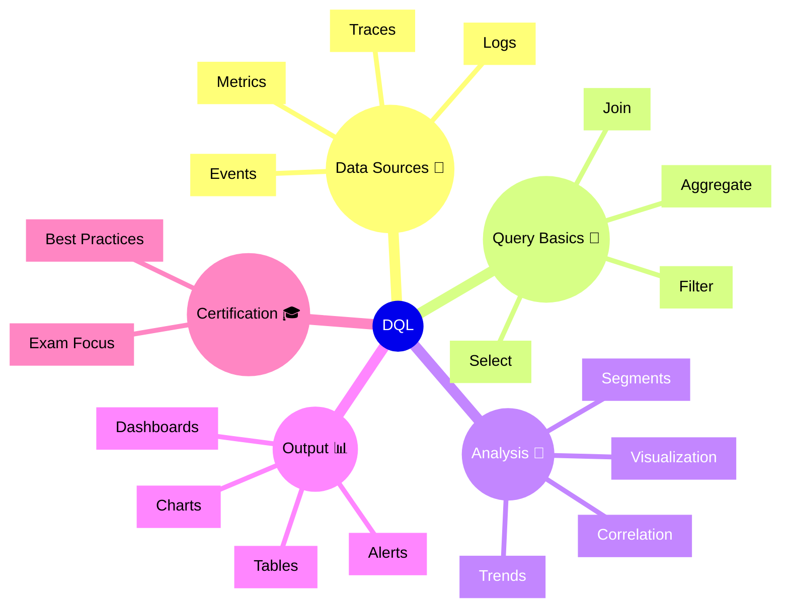

# Dynatrace DQL

## Overview

Dynatrace DQL (Dynatrace Query Language) lets users query and analyze observability data using a flexible syntax. For the DynaTrace Associate certification, this function is important because it shows how custom queries can retrieve metrics, events, logs, and traces beyond standard dashboards.

## DQL Mindmap

## Key Concepts

- **DQL**: Dynatrace Query Language for advanced observability queries.
- **Query**: A request that filters and aggregates observability data.
- **Data Source**: The set of observability data queried, such as metrics, logs, traces, or events.
- **Aggregation**: Summarizing data using functions like count, sum, or average.
- **Visualization**: Displaying query results as tables, charts, or dashboards.

## Main Features

### Flexible Querying
- Query multiple data sources with a unified syntax.
- Filter by entity, metric, or event attributes.
- Aggregate results for deep analysis.

### Cross-Domain Analysis
- Correlate logs, traces, problems, and metrics in one query.
- Use joins and merges to combine related data sets.
- Identify patterns across different observability domains.

### Results Visualization
- Render query output as tables, charts, or heatmaps.
- Save queries to dashboards and reports.
- Use query results for alerts and notebooks.

### Use in Workflows
- Add DQL queries to dashboards or alerts for custom monitoring.
- Use DQL for ad hoc investigations and root cause analysis.
- Share queries with teams for consistent analysis.

## Typical Uses for the Associate Certification

- Understanding how DQL can augment standard observability views.
- Recognizing when to use custom queries for complex analysis.
- Learning how query results can be displayed or used in alerts.
- Understanding the basic structure of DQL queries.

## Exam-Relevant Focus

- Know that DQL is used for advanced query-based analysis.
- Understand the difference between data sources and query output.
- Be able to explain why custom queries are useful for troubleshooting.
- Remember that DQL results can be visualized and shared.

## Best Practices

- Start with standard dashboards and use DQL for deeper questions.
- Keep queries focused and reusable.
- Use DQL output in dashboards, alerts, and notebooks.
- Validate filters and aggregations before sharing queries.

## Summary

Dynatrace DQL enables advanced, cross-domain observability queries. For Associate certification, it highlights the power of custom data retrieval and visualization beyond built-in monitoring views.

## Related Resources
- [DynaTrace Query Language](https://docs.dynatrace.com/docs/shortlink/dql-dynatrace-query-language-hub)
- [How to Use DQL Queries](https://docs.dynatrace.com/docs/shortlink/dql-use-queries)
- [Beginners Exercise](https://wkf10640.apps.dynatrace.com/ui/apps/dynatrace.learndql/)