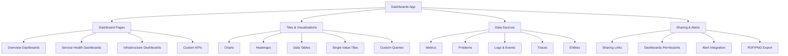

# Dynatrace Dashboards App

## Overview

The Dynatrace Dashboards app lets users create custom visualizations and summary views of monitored data. In the context of the DynaTrace Associate certification, this app is important because it demonstrates how to present performance metrics, health information, and problem trends in dashboards for faster insight and communication.

## Dashboards App Diagram

## Key Concepts

- **Dashboard**: A customizable page that aggregates tiles and visual content for monitoring and reporting.
- **Tile**: A widget on a dashboard that displays a chart, metric, problem list, or custom content.
- **Data source**: The Dynatrace object or dataset used to populate a dashboard tile, such as metrics, problems, logs, or traces.
- **Dashboard Library**: A collection of predefined dashboards or shared dashboard templates.
- **Sharing**: The ability to share dashboards with individuals, teams, or external stakeholders.

## Main Features

### Customizable Visualization
- Build dashboards with charts, graphs, tables, and single-value tiles.
- Use custom metrics, built-in metrics, and calculated expressions.
- Configure timeframes, filters, and display settings per tile.

### Centralized Monitoring Views
- Create overview dashboards for application health, infrastructure status, or service performance.
- Combine metrics, problem feeds, and service health data on a single page.
- Support dashboard views for teams, SREs, and business stakeholders.

### Data Integration
- Pull in metrics, events, logs, traces, and problems from Dynatrace.
- Use entity selectors and filters to focus on services, hosts, containers, or custom applications.
- Display real-time and historical data side by side.

### Collaboration and Distribution
- Share dashboards with users, groups, and external links if enabled.
- Export dashboard views as images or PDF for reporting.
- Use dashboard permissions to control access and editing rights.

### Reusability and Templates
- Create dashboard templates for repeatable monitoring patterns.
- Use cloned dashboards as a starting point for new monitoring views.
- Save frequently used dashboards to the dashboard library.

## Typical Uses for the Associate Certification

- Understanding how Dynatrace presents key performance indicators in a visual way.
- Learning which dashboard tiles are useful for different audiences.
- Identifying how to combine service, infrastructure, and problem data in one view.
- Knowing how dashboards support monitoring, reporting, and incident review.

## Exam-Relevant Focus

- Know that Dynatrace dashboards display metrics, problems, and events using tiles.
- Understand how dashboard filters and entity selectors narrow the scope of displayed data.
- Be able to explain the difference between standard dashboards and custom dashboards.
- Recognize that dashboards can be shared and exported for wider consumption.
- Remember that dashboards are useful for tracking SLA, capacity, and availability trends.

## Best Practices

- Use dashboards to summarize the most important health metrics for a service or environment.
- Keep dashboards focused and avoid overloading them with too many tiles.
- Use consistent naming and layout for dashboards shared across teams.
- Leverage shared templates when creating new dashboards for common use cases.
- Regularly review dashboards to ensure they reflect current priorities and alerts.

## Summary

The Dynatrace Dashboards app provides a flexible way to visualize Dynatrace data and communicate the state of monitored systems. For the DynaTrace Associate certification, it highlights how custom dashboards support monitoring, collaboration, and rapid issue detection.
