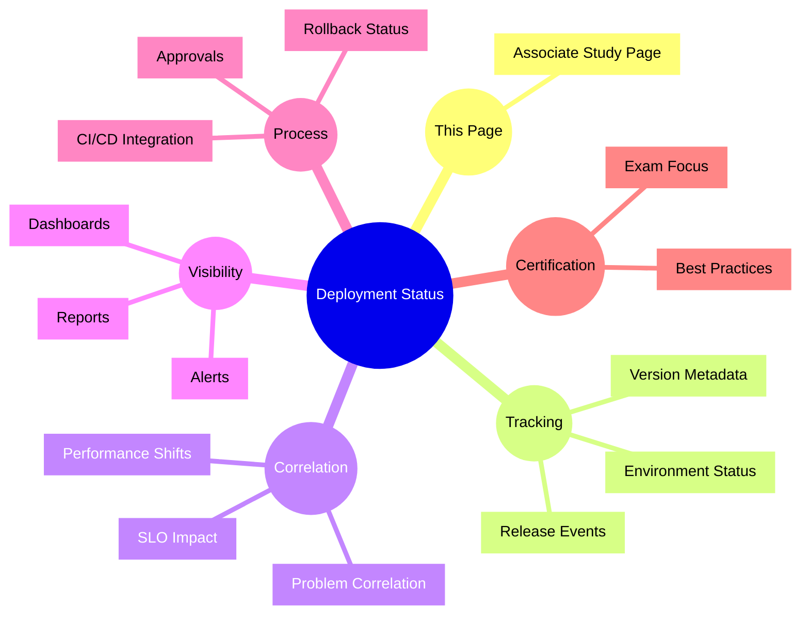

# Dynatrace Deployment Status

## Overview

Deployment Status in Dynatrace tracks the rollout and impact of application changes. For the DynaTrace Associate certification, this component is important because it helps correlate deployments with performance shifts, problems, and business impact.

## Deployment Status Mindmap

## Key Concepts

- **Deployment status**: The state of an application or service rollout, including version, environment, and release event metadata.
- **Release tracking**: Capturing deployment events and associating them with code changes or build versions.
- **Correlation**: Linking deployments to performance changes, detected problems, or service-level objective violations.
- **Environment visibility**: Monitoring deployment health across staging, production, or hybrid environments.
- **CI/CD connection**: Feeding deployment status from build and deployment pipelines into Dynatrace.

## Main Features

### Release event tracking
- Records deployment start, success, and failure events.
- Captures release metadata such as version, deployer, and target environment.
- Provides a timeline of deployments for analysis.

### Deployment impact analysis
- Correlates deployments with service performance changes and problems.
- Helps identify whether a new release caused regression or improvement.
- Supports post-deployment review for business stakeholders.

### Visibility and alerting
- Displays deployment status on dashboards and release tracking pages.
- Generates alerts for failed or risky deployments.
- Supports reporting on release health and deployment trends.

### CI/CD and release integration
- Integrates with CI/CD tools to ingest deployment events automatically.
- Uses deployment metadata to link code versions with observed behavior.
- Helps bridge DevOps processes with Dynatrace observability.

## Typical Uses for the Associate Certification

- Understanding how deployment events are visible in Dynatrace.
- Recognizing the value of correlating release status with performance and problems.
- Knowing that deployment status is part of digital experience and service health tracking.
- Explaining how deployment metadata supports post-release analysis.
- Using deployment status to validate whether a release caused new issues.

## Exam-Relevant Focus

- Know that deployment status is used to track releases and their impact on application health.
- Understand the link between deployments, problems, and performance metrics.
- Be able to explain how deployment events aid root cause analysis after a release.
- Remember that Dynatrace can ingest CI/CD deployment metadata for better observability.

## Best Practices

- Track deployment status for key applications and services.
- Link release metadata to performance and error metrics.
- Review deployments after production releases to catch regressions early.
- Use deployment visibility to support DevOps and reliability workflows.

## Summary

Dynatrace Deployment Status helps teams understand the impact of releases by tracking status, correlating changes to problems, and improving observability around code deployment. For Associate certification, it underscores the importance of release-aware monitoring and post-deployment analysis.