# Dynatrace Digital Experience

## Overview

The Dynatrace Digital Experience app provides visibility into how users interact with applications and how those interactions perform. For the DynaTrace Associate certification, this app is important because it shows how Dynatrace tracks real user experience (RUM) and synthetic monitoring to identify user-impacting issues.

## Digital Experience Diagram

```mermaid
flowchart TD
  A[Digital Experience] --> B[Real User Monitoring]
  A --> C[Synthetic Monitoring]
  A --> D[User Sessions]
  A --> E[Performance Metrics]
  A --> F[Problems & Insights]

  B --> B1[Web RUM]
  B --> B2[Mobile RUM]
  B --> B3[Session Replay]
  B --> B4[Geography]

  C --> C1[Availability Tests]
  C --> C2[Performance Tests]
  C --> C3[API Monitoring]
  C --> C4[SLOs]

  D --> D1[User Actions]
  D --> D2[User Journeys]
  D --> D3[Conversion]
  D --> D4[Error Sessions]

  E --> E1[Load Time]
  E --> E2[Apdex]
  E --> E3[Resource Timing]
  E --> E4[XHR & Fetch]

  F --> F1[User Experience Problems]
  F --> F2[Root Cause]
  F --> F3[Impact]
  F --> F4[Problem Feed]
```

## Key Concepts

- **Digital Experience**: The end-to-end monitoring of how real users and synthetic tests interact with applications.
- **Real User Monitoring (RUM)**: Collects performance data from actual user sessions in web and mobile applications.
- **Synthetic Monitoring**: Uses scripted tests to monitor application endpoints, APIs, and user journeys from fixed locations.
- **User Session**: A recorded period of user interaction that can be analyzed for performance and errors.
- **Apdex**: A satisfaction score that measures user experience based on response time thresholds.

## Main Features

### Real User Monitoring
- Tracks performance metrics for actual users, including page load time, resource timing, and user actions.
- Monitors web and mobile applications to capture issues as they occur for real visitors.
- Identifies geographic, device, browser, and network patterns that affect user experience.

### Synthetic Monitoring
- Executes scripted tests that emulate user journeys and API transactions.
- Measures availability, response time, and success rate from global locations.
- Supports SLO tracking and alerting for synthetic test results.

### User Session and Action Analysis
- Provides a breakdown of user sessions, actions, and errors.
- Helps identify which user actions are slow or failing.
- Enables drill-down into session details for root-cause analysis.

### Performance Metrics and KPIs
- Captures load times, time to first byte, DOM interactive time, and full page load time.
- Measures Apdex and user satisfaction metrics.
- Tracks XHR and fetch request performance, resource load times, and front-end errors.

### Problem Detection and Insights
- Detects user-impacting problems such as slow pages, error rates, and crashes.
- Correlates digital experience issues with underlying services and infrastructure.
- Uses Dynatrace AI to identify root causes and impacted user segments.

### Reporting and Dashboards
- Enables dashboards and reports tailored to user experience metrics.
- Supports monitoring of user journeys, conversion funnels, and key business transactions.
- Shares insights with stakeholders through dashboards and alerting.

## Typical Uses for the Associate Certification

- Understanding how Dynatrace measures real user experience and synthetic availability.
- Identifying user-impacting issues like slow page loads or increased error rates.
- Recognizing how session and action analysis helps find the exact affected user flows.
- Learning how Apdex and performance KPIs are used to assess digital experience.
- Knowing how digital experience problems are linked to Dynatrace problems and services.

## Exam-Relevant Focus

- Know the difference between Real User Monitoring and Synthetic Monitoring.
- Understand the types of user experience metrics Dynatrace collects.
- Be able to explain why user sessions and actions matter for troubleshooting.
- Recognize how digital experience issues can be correlated with backend services.
- Remember that Apdex and availability are common certification concepts.

## Best Practices

- Use the Digital Experience app to identify issues before they impact more users.
- Combine RUM and synthetic data to validate both real and expected user journeys.
- Focus on high-impact user actions and geographic segments when troubleshooting.
- Use session filters to isolate performance problems by browser, location, or user type.
- Monitor synthetic tests and user experience metrics as part of SLA and SLO tracking.

## Summary

The Dynatrace Digital Experience app is essential for understanding how users perceive application performance. It provides RUM, synthetic monitoring, user session insights, and problem detection that are key topics for the DynaTrace Associate certification.
