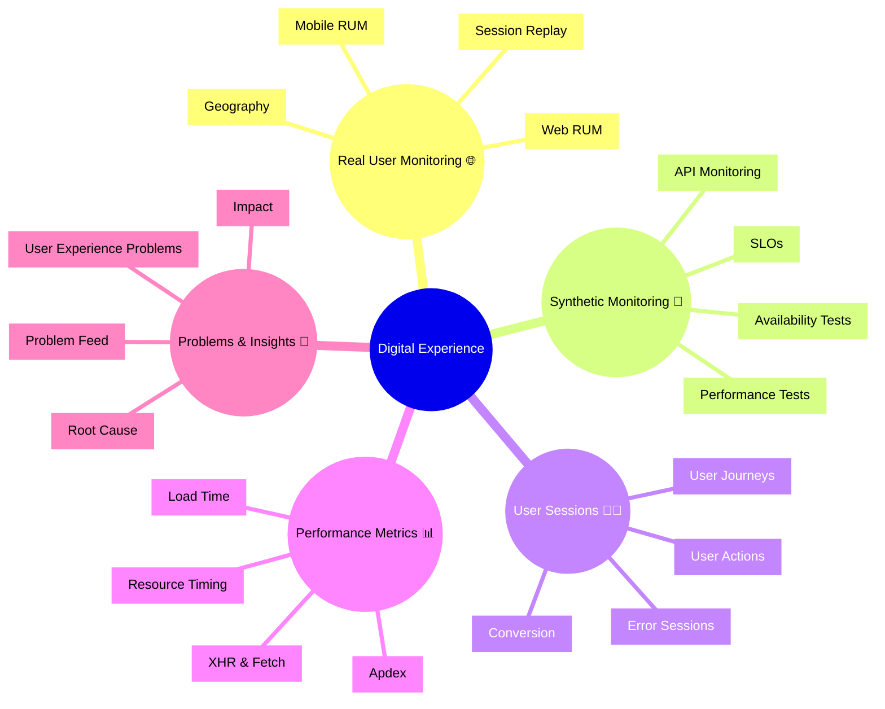

# Dynatrace Digital Experience Flashcards

## Overview

These flashcards cover key Dynatrace Digital Experience concepts for the DynaTrace Associate certification. Each card includes iconic descriptions and a Mermaid mindmap to support quick memorization.

## Digital Experience Mindmap

## Flashcards

### Q: What is Dynatrace Digital Experience? 🌟
A: The monitoring of how users interact with applications through Real User Monitoring and Synthetic Monitoring to measure availability, performance, and overall user satisfaction.

### Q: What is Real User Monitoring (RUM)? 👀
A: Real User Monitoring captures actual user sessions, browser and device details, and page performance data from real visitors.

### Q: What is Synthetic Monitoring? 🛠️
A: Synthetic Monitoring uses scripted tests to monitor availability and performance from fixed locations, emulating user journeys and API behavior.

### Q: What is a user session? 🧩
A: A recorded period of user interaction that includes actions, page loads, errors, and performance data.

### Q: What is Apdex? 😊
A: A satisfaction score that measures user experience based on response time thresholds and indicates whether performance is acceptable.

### Q: Why are load times important? ⏱️
A: Because they directly impact user satisfaction and can indicate slow page performance or frontend bottlenecks.

### Q: What are common user experience metrics? 📈
A: Load time, Apdex, resource timing, XHR/fetch performance, and error sessions.

### Q: What is session replay used for? 🎞️
A: To review recorded user interactions and visualize exactly how users experienced pages, actions, and errors.

### Q: What is the significance of synthetic SLOs? 🧭
A: SLOs track agreed performance and availability targets for synthetic tests and support proactive monitoring.

### Q: How does Dynatrace link Digital Experience problems to backend issues? 🔗
A: It correlates user-impacting problems with underlying services, infrastructure, and traces so you can identify root causes.

### Q: What is a user experience problem? 🚨
A: A detected issue that affects actual user interactions, such as slow page loads, errors, or crashes.

### Q: What should Associate candidates remember about Digital Experience? 🎓
A: That it combines real user monitoring and synthetic monitoring to reveal user impact, availability, and performance issues.

### Q: What is the best way to use Digital Experience in troubleshooting? 🔍
A: Start with user sessions and synthetic test results, then correlate performance metrics with problems and backend dependencies.

### Q: What is an iconic description for synthetic monitoring? 🧪
A: `Synthetic Monitoring 🤖` because it uses scripted checks to simulate user behavior from external locations.

### Q: What is an iconic description for RUM? 🌍
A: `Real User Monitoring 🌐` because it tracks how real users experience your web or mobile application.
