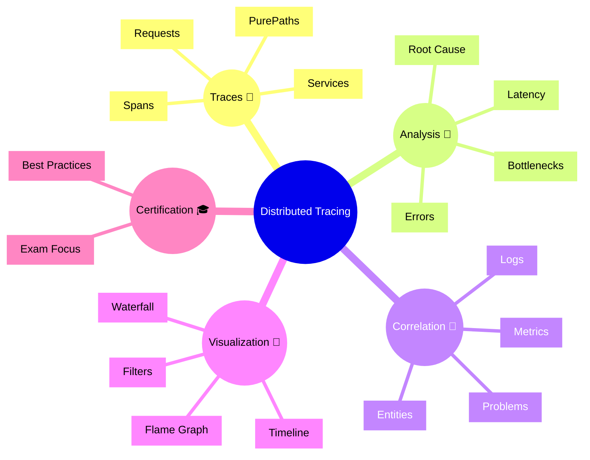

# Dynatrace Distributed Tracing

## Overview

The Dynatrace Distributed Tracing app tracks requests across services and infrastructure using end-to-end trace data. For the DynaTrace Associate certification, this app is important because it reveals how requests flow through the stack and where latency or errors occur.

## Distributed Tracing Mindmap

## Key Concepts

- **Distributed Tracing**: Monitoring the path of a request through multiple services and components.
- **PurePath**: Dynatrace’s detailed trace representation of a request.
- **Span**: A single operation or call within a trace.
- **Latency**: The time taken for a request or span to complete.
- **Trace Correlation**: Linking traces with logs, metrics, and problems.

## Main Features

### End-to-End Tracing
- Captures the full request path across services and infrastructure.
- Uses PurePaths to show service calls, operations, and timing.
- Helps identify where latency or failures occur in the flow.

### Trace Analysis
- Analyzes latency, errors, and bottlenecks.
- Uses visualizations like timelines and flame graphs.
- Supports filtering by request type, service, or error.

### Cross-Domain Correlation
- Correlates traces with logs, metrics, and problems.
- Provides additional context for root cause analysis.
- Helps validate a suspected issue with multiple data sources.

### Visualization and Filtering
- Displays trace timelines and operation breakdowns.
- Uses filters to isolate slow or failed requests.
- Highlights service dependencies and call sequences.

## Typical Uses for the Associate Certification

- Understanding how Dynatrace captures request traces across services.
- Recognizing the difference between traces, spans, and services.
- Learning how trace data is used to find latency and failure points.
- Using trace correlation to support broader incident analysis.

## Exam-Relevant Focus

- Know that Distributed Tracing tracks request flow end to end.
- Understand what PurePaths and spans represent.
- Be able to explain how tracing helps locate bottlenecks.
- Remember that traces link to logs, metrics, and problems.

## Best Practices

- Start with the service trace when investigating performance issues.
- Use filtering to focus on slow or failing requests.
- Correlate trace findings with logs and metrics for confirmation.
- Keep trace data handy for incident reports and root cause documentation.

## Summary

Dynatrace Distributed Tracing provides the visibility needed to understand request flow and performance issues across services. For Associate certification, it emphasizes the role of traces in end-to-end analysis and root cause detection.
