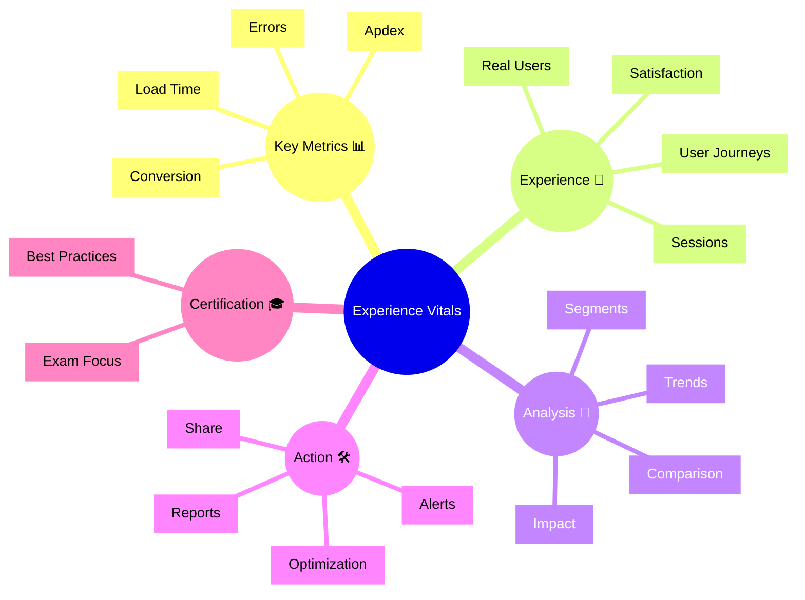

# Dynatrace Experience Vitals

## Overview

The Dynatrace Experience Vitals app tracks user experience metrics that matter most, such as Apdex, page load performance, and user satisfaction. For the DynaTrace Associate certification, this app helps you understand how vital metrics reveal real user experience issues.

## Experience Vitals Mindmap

## Key Concepts

- **Experience Vitals**: Metrics that indicate the quality of user interactions and digital experience.
- **Apdex**: A score reflecting user satisfaction based on response time thresholds.
- **Core Web Vitals**: Browser metrics like LCP, CLS, and INP that influence load experience, stability, and responsiveness.
- **User Journey**: The sequence of actions a user takes through an application.
- **Session**: A recorded period of user activity within an application.
- **User Impact**: The effect of performance or error issues on real users.

## Main Features

### Experience Metrics
- Displays Apdex, load times, error rates, and conversion indicators.
- Focuses on metrics that most affect user satisfaction.
- Links experience metrics to browser, device, and geographic segments.

### User Experience Analysis
- Identifies slow pages, failed interactions, and degradation patterns.
- Correlates experience metrics with specific user journeys.
- Includes Core Web Vitals signals such as LCP, CLS, and INP to identify experience degradations.
- Supports segmentation by user type, location, and technology.

### Trend and Comparison
- Tracks experience metrics over time to find regressions.
- Compares metrics across environments, versions, or segments.
- Helps validate whether changes improve or worsen user experience.

### Remediation and Alerting
- Enables alerts for critical experience degradations.
- Supports reporting to stakeholders on user impact.
- Helps prioritize fixes that improve actual satisfaction.

## Typical Uses for the Associate Certification

- Understanding which metrics Dynatrace considers vital for user experience.
- Recognizing how Apdex and load time reflect user satisfaction.
- Seeing how experience issues are tied to real user sessions.
- Learning how to prioritize experience problems for remediation.

## Exam-Relevant Focus

- Know that Experience Vitals focuses on user satisfaction metrics like Apdex and load time.
- Understand how session and journey data support experience analysis.
- Be able to explain why segmenting metrics by geography or device matters.
- Know that Experience Vitals can surface Core Web Vitals issues such as LCP, CLS, and INP.
- Remember that experience vitals are directly tied to user impact.

## Best Practices

- Monitor Experience Vitals alongside service and problem data.
- Use trends and comparisons to validate performance improvements.
- Focus on the metrics that have the biggest user impact first.
- Share experience reports with business stakeholders.

## Related Links
- [What is AppDex](https://raygun.com/blog/apdex-score-guide/)
- [AppDex Guide](https://raygun.com/blog/apdex-score-guide/)
- [Core Web Vitals overview](https://web.dev/vitals/)
- [Largest Contentful Paint (LCP)](https://web.dev/lcp/)
- [Cumulative Layout Shift (CLS)](https://web.dev/cls/)
- [Interaction to Next Paint (INP)](https://web.dev/inp/)

## Summary

Dynatrace Experience Vitals helps teams measure and improve the user experience by focusing on the most important satisfaction signals. For Associate certification, it emphasizes user-centric metrics, session context, and experience impact.
