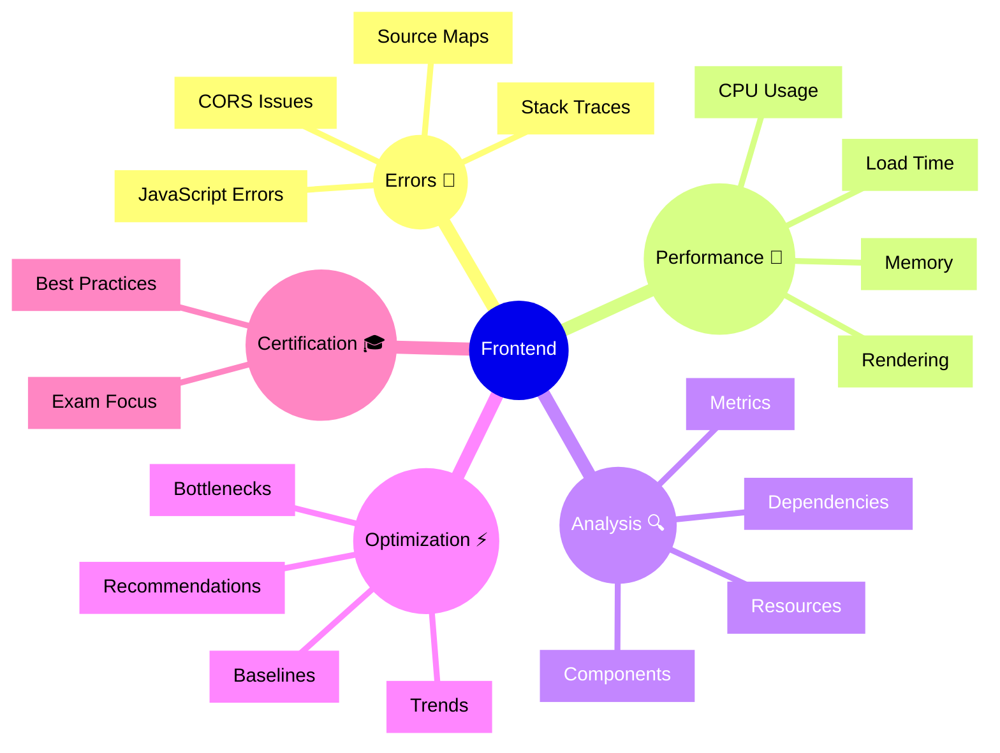

# Dynatrace Frontend

## Overview

The Dynatrace Frontend app focuses on JavaScript and front-end layer performance monitoring. For the DynaTrace Associate certification, this app is important because it shows how Dynatrace analyzes front-end code performance and client-side issues.

## Frontend Mindmap

## Key Concepts

- **JavaScript Error**: A runtime error in client-side code that may impact user experience.
- **Source Map**: A file that maps minified code to original source code for better error diagnostics.
- **Resource Timing**: Measurements of how long resources take to load and execute.
- **Core Web Vitals**: Browser metrics for load speed, visual stability, and responsiveness such as LCP, CLS, and INP.
- **Rendering Performance**: The efficiency of DOM manipulation and painting.
- **CORS**: Cross-Origin Resource Sharing issues that affect API calls from the browser.

## Main Features

### JavaScript Error Tracking
- Captures unhandled exceptions and errors in JavaScript.
- Uses source maps to link errors to original code locations.
- Groups errors by type and frequency for prioritization.

### Performance Analysis
- Analyzes JavaScript execution time and blocking operations.
- Measures DOM interaction and rendering performance.
- Uses Core Web Vitals such as LCP, CLS, and INP to expose front-end load, stability, and responsiveness issues.
- Identifies slow functions and CPU-intensive operations.

### Resource Management
- Tracks loading and execution of scripts, styles, and other resources.
- Identifies unused or slow-loading resources.
- Provides optimization recommendations.

### Memory Monitoring
- Tracks memory usage and potential memory leaks.
- Identifies garbage collection pauses that impact performance.
- Helps diagnose memory-related performance issues.

### Error Context and Breadcrumbs
- Provides detailed information about the user's actions before an error.
- Includes browser console messages and network activity.
- Enables faster diagnosis and troubleshooting.

### Integration with Services
- Links frontend errors to backend services and API calls.
- Correlates client-side performance with server response times.
- Shows end-to-end impact of issues.

## Typical Uses for the Associate Certification

- Understanding how Dynatrace monitors JavaScript and front-end code.
- Recognizing how front-end errors impact user experience.
- Learning how source maps improve error diagnostics.
- Seeing how front-end performance metrics are used in SLOs.
- Understanding the role of front-end monitoring in digital experience.

## Exam-Relevant Focus

- Know that Frontend app focuses on JavaScript execution and errors.
- Understand the importance of source maps for error diagnostics.
- Be able to explain how front-end performance affects user satisfaction.
- Recognize that front-end errors can correlate with backend issues.
- Know that Core Web Vitals such as LCP, CLS, and INP are important for frontend experience quality.
- Remember that front-end metrics are part of overall digital experience.

## Best Practices

- Deploy source maps in production for better error diagnostics.
- Monitor JavaScript error rates and prioritize high-impact errors.
- Use front-end performance data to establish SLOs.
- Optimize resource loading and execution time.
- Correlate front-end issues with backend data for root cause analysis.
- Track Core Web Vitals to understand how frontend performance affects real user experience.

## Related Links
- [Core Web Vitals overview](https://web.dev/vitals/)
- [Largest Contentful Paint (LCP)](https://web.dev/lcp/)
- [Cumulative Layout Shift (CLS)](https://web.dev/cls/)
- [Interaction to Next Paint (INP)](https://web.dev/inp/)

## Summary

Dynatrace Frontend provides detailed JavaScript and client-side performance monitoring. For Associate certification, it demonstrates how front-end observability contributes to understanding user experience and identifying performance optimization opportunities.
