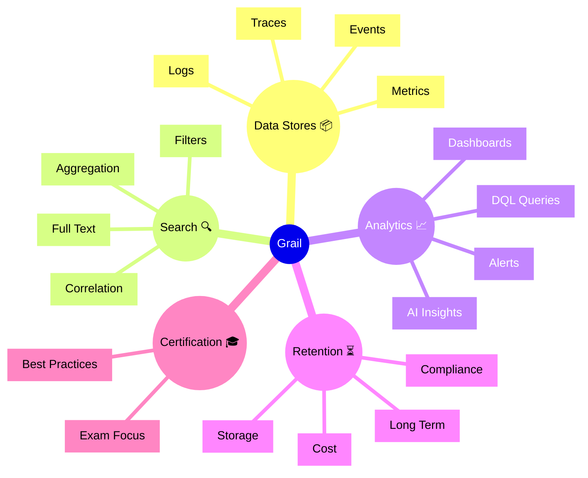

# Dynatrace Grail

## Overview

Dynatrace Grail is a high-performance observability data lake for metrics, events, logs, and traces. For the DynaTrace Associate certification, Grail is important because it provides the foundation for long-term data retention, search, and advanced analytics.

## Grail Mindmap

## Key Concepts

- **Grail**: Dynatrace’s scalable observability data lake for long-term storage and search.
- **Observability Data**: Metrics, logs, traces, and events stored in Grail.
- **Search**: The ability to query and find observability data quickly.
- **Retention**: How long observability data is kept for analysis.
- **Analytics**: Using Grail data for dashboards, alerts, and AI-driven insights.

## Main Features

### Unified Data Lake
- Stores metrics, logs, traces, and events in one system.
- Enables cross-domain analysis and long-term retention.
- Supports high-performance search over vast observability data.

### Search and Query
- Search data with filters, full-text, and aggregation.
- Use DQL to retrieve and analyze Grail data.
- Correlate different observability domains in one query.

### Analytics and Insights
- Power dashboards, alerts, and incident analysis with Grail data.
- Provide AI-supported insights and anomaly detection.
- Support custom analytics for advanced observability use cases.

### Retention and Compliance
- Manage long-term data retention policies.
- Balance storage cost with compliance and analysis requirements.
- Keep historical observability data for audits and trends.

## Typical Uses for the Associate Certification

- Understanding Grail as the core data layer for Dynatrace observability.
- Recognizing how long-term storage and search support analysis.
- Learning how Grail data can be queried and visualized.
- Seeing how Grail supports metrics, logs, traces, and event correlation.

## Exam-Relevant Focus

- Know that Grail is the observability lake for key telemetry data.
- Understand how Grail enables search, analytics, and retention.
- Be able to explain why unified storage matters for Dynatrace.
- Remember that Grail underpins DQL queries and AI insights.

## Best Practices

- Use Grail for historical analysis and long-term troubleshooting.
- Keep retention policies aligned with business and compliance needs.
- Use Grail search for cross-domain observability queries.
- Monitor Grail storage usage against cost and retention goals.

## Summary

Dynatrace Grail unifies observability data into a powerful data lake. For Associate certification, it highlights the role of scalable search, analytics, and retention in modern observability.
