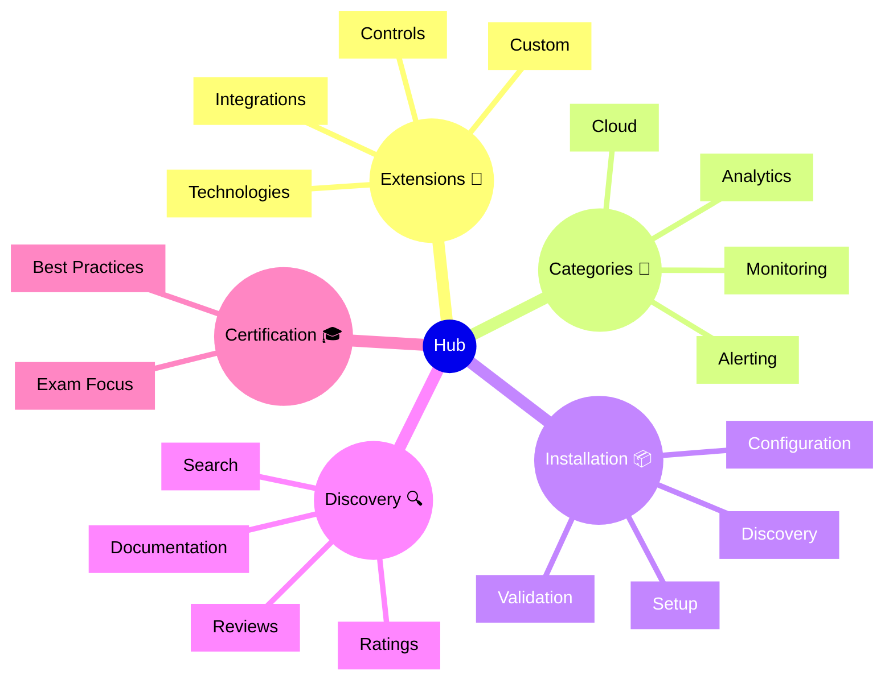

# Dynatrace Hub

## Overview

The Dynatrace Hub is a marketplace for extensions, integrations, and community content. For the DynaTrace Associate certification, this app is important because it shows how Dynatrace can be extended and integrated with other tools and platforms.

## Hub Mindmap

## Key Concepts

- **Extension**: A plugin or add-on that extends Dynatrace capabilities.
- **Integration**: A connection between Dynatrace and another platform or tool.
- **ActiveGate Extension**: Custom code running on ActiveGate to monitor specific systems.
- **Problem Notification**: An integration that sends Dynatrace alerts to external systems.
- **Custom Metric**: User-defined metrics ingested into Dynatrace via extensions.

## Main Features

### Extension Types
- **ActiveGate Extensions**: Custom monitoring plugins that run on ActiveGate.
- **Cloud Integration Extensions**: Integrations with cloud provider services.
- **Problem Notification Extensions**: Outbound integrations for alerting (Slack, ServiceNow, etc.).
- **API Integrations**: Custom integrations via Dynatrace APIs.

### Discovery and Search
- Browse available extensions by category and technology.
- Search for specific monitoring or integration needs.
- View ratings, reviews, and documentation for each extension.

### Installation and Configuration
- Simple one-click installation for supported extensions.
- Step-by-step configuration guides for setup.
- Validation to ensure proper installation and functioning.

### Documentation and Support
- Built-in documentation for each extension.
- Links to support resources and community forums.
- Release notes and update information.

### Community and Custom Content
- User-created extensions and integrations.
- Community recommendations and best practices.
- Feedback and ratings to help evaluate quality.

### OneAgent and API Extensions
- Custom metrics via OneAgent extensions.
- Advanced monitoring via Dynatrace API.
- Support for bringing in external data.

## Typical Uses for the Associate Certification

- Understanding how Dynatrace can be extended and integrated.
- Recognizing common extension types and use cases.
- Learning how extensions enable monitoring of custom technologies.
- Seeing how integrations connect Dynatrace with other tools.
- Understanding the role of the Hub in expanding Dynatrace capabilities.

## Exam-Relevant Focus

- Know that the Hub provides extensions and integrations.
- Understand the types of extensions available (ActiveGate, cloud, notifications).
- Be able to explain how extensions enable monitoring of custom technologies.
- Recognize that integrations support multi-tool workflows.
- Remember that the Hub is a resource for expanding Dynatrace beyond core functionality.

## Best Practices

- Explore the Hub for extensions that match your monitoring needs.
- Review documentation and ratings before installing extensions.
- Test extensions in non-production environments first.
- Keep extensions updated to get bug fixes and new features.
- Contribute feedback and ratings to help the community.

## Summary

Dynatrace Hub provides a marketplace of extensions and integrations. For Associate certification, it demonstrates how Dynatrace can be extended to monitor custom technologies and integrated with other operational tools and platforms.
