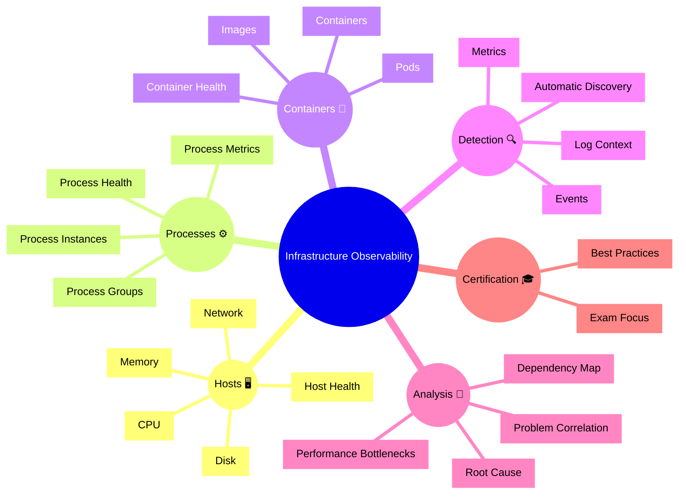

# Dynatrace Infrastructure Observability

## Overview

The Dynatrace Infrastructure Observability app provides visibility into the health and performance of hosts, processes, containers, and infrastructure services. In the context of the DynaTrace Associate certification, this app is important because it demonstrates how Dynatrace links infrastructure metrics with application and service performance to support problem detection and root cause analysis.

## Infrastructure Observability Mindmap

## Key Concepts

- **Infrastructure Observability**: Monitoring the underlying host, process, and container resources that support applications and services.
- **Host**: A physical or virtual machine that reports CPU, memory, disk, and network metrics.
- **Process Group**: A set of similar processes grouped by Dynatrace to simplify monitoring and analysis.
- **Container**: A runtime instance of a container image, often part of a pod or service.
- **Auto-discovery**: The ability of Dynatrace to detect infrastructure components automatically and begin collecting metrics without manual configuration.

## Main Features

### Host Monitoring
- Shows host health, resource usage, and system metrics.
- Tracks CPU, memory, disk I/O, network traffic, and load.
- Detects host-level problems such as kernel issues, saturation, and unavailable hosts.

### Process and Service Monitoring
- Displays process groups, individual process instances, and process-level metrics.
- Monitors process health and resource consumption.
- Identifies runaway processes, process crashes, and service restarts.

### Container Visibility
- Monitors pods and containers in containerized environments.
- Tracks container resource usage, restarts, and image status.
- Connects containers to services, hosts, and processes for full-stack observability.

### Automatic Discovery and Context
- Automatically discovers hosts, processes, containers, and services using OneAgent and platform integrations.
- Provides topology context so infrastructure entities are linked to services and applications.
- Uses metadata and labels to group and filter infrastructure resources.

### Problem Detection and Correlation
- Detects infrastructure problems and correlates them with service or application issues.
- Uses Dynatrace AI to identify probable root causes across infrastructure and application layers.
- Shows impact and affected entities for faster incident response.

### Infrastructure Metrics and KPIs
- CPU utilization and saturation
- Memory usage and paging
- Disk latency, throughput, and errors
- Network throughput and packet loss
- Process and container restart counts

### Troubleshooting and Analysis
- Drill into host, process, and container details to find anomalies.
- Use dependency maps to understand how infrastructure issues affect services.
- Compare historical infrastructure metrics to spot trends and regressions.

## Typical Uses for the Associate Certification

- Understanding how infrastructure health influences application and service performance.
- Identifying host, process, or container issues that cause service degradation.
- Learning how Dynatrace links infrastructure entities to problems and services.
- Using the Infrastructure app to spot resource bottlenecks and system-level anomalies.

## Exam-Relevant Focus

- Know the difference between host, process, and container observability.
- Understand how automatic discovery works for infrastructure entities.
- Be able to explain why infrastructure observability is important for root cause analysis.
- Recognize common infrastructure metrics and what they indicate.
- Remember that Dynatrace correlates infrastructure problems with impacted services and applications.

## Best Practices

- Start troubleshooting at the infrastructure layer when service or application problems appear.
- Focus on resource saturation, process failures, and container restarts.
- Use metadata and tagging to filter infrastructure entities by environment or role.
- Correlate infrastructure health with service dependencies for faster diagnosis.
- Validate that infrastructure issues are not masking deeper application problems.

## Summary

The Dynatrace Infrastructure Observability app is essential for monitoring the systems that support applications and services. It delivers automatic discovery, resource metrics, process and container visibility, and AI-driven problem correlation that are all important for the DynaTrace Associate certification.
