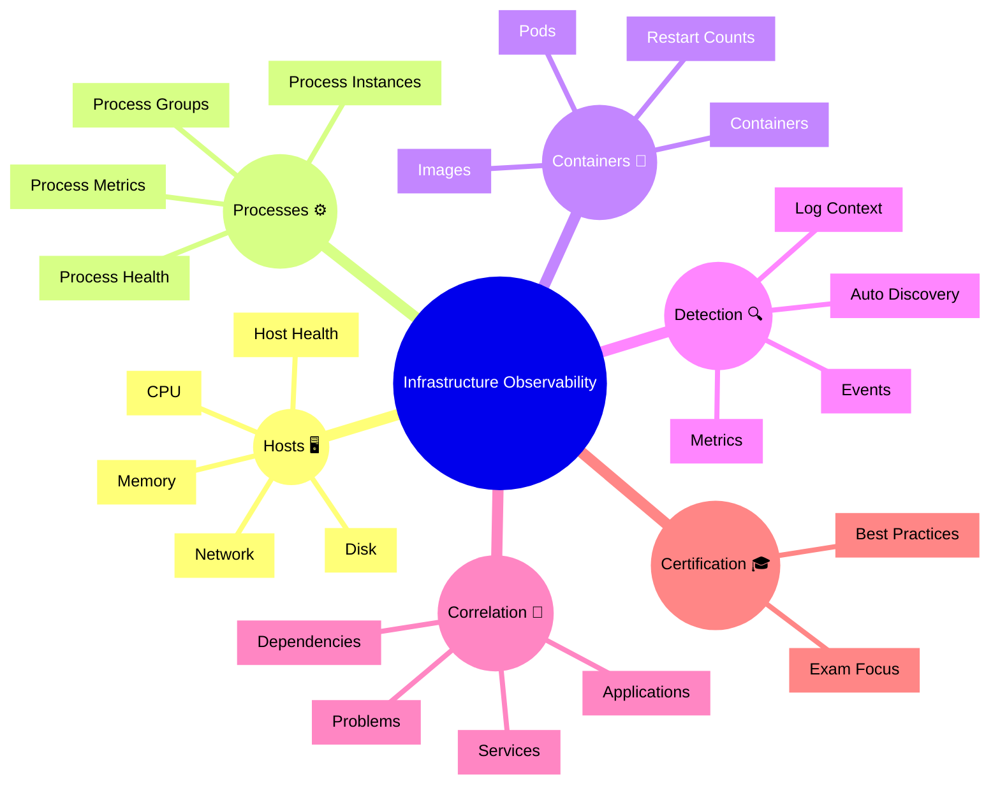

# Dynatrace Infrastructure Observability Flashcards

## Overview

These flashcards cover key Dynatrace Infrastructure Observability concepts for the DynaTrace Associate certification. They include Mermaid diagrams and iconic descriptions to help remember how infrastructure monitoring supports application and service observability.

## Infrastructure Observability Mindmap

## Flashcards

### Q: What is Dynatrace Infrastructure Observability? 🛰️
A: Monitoring the host, process, container, and infrastructure resources that support applications and services.

### Q: What does host observability focus on? 🖥️
A: CPU, memory, disk, network, and host health metrics.

### Q: What are process groups? 🧠
A: Collections of similar processes grouped by Dynatrace to simplify monitoring and analysis.

### Q: Why monitor containers in infrastructure observability? 📦
A: Because containers represent runtime units that can impact service performance and stability.

### Q: What is a key sign of infrastructure issues? 🚨
A: High CPU/memory saturation, disk latency, network errors, or repeated process/container restarts.

### Q: What is automatic discovery? 🤖
A: Dynatrace’s ability to detect infrastructure entities automatically and start collecting telemetry without manual setup.

### Q: Why is correlation important in infrastructure observability? 🔗
A: It links infrastructure issues to services, applications, and problems so you can find the real root cause.

### Q: What does a container restart count indicate? 🔄
A: It indicates unstable containers, often caused by crashes, out-of-memory conditions, or probe failures.

### Q: How do logs support infrastructure observability? 📜
A: They provide context and detail for infrastructure events and help diagnose anomalies.

### Q: What is a good best practice for infrastructure troubleshooting? 🛠️
A: Start by checking host and container health, then drill into process metrics and correlation with services.

### Q: What should Associate candidates remember about infrastructure metrics? 📊
A: CPU, memory, disk, and network metrics are crucial indicators of system health and resource capacity.

### Q: What role do dependency maps play? 🗺️
A: They show how infrastructure components relate to services and help identify downstream impact from failures.

### Q: What is an iconic description of infrastructure detection? 🔍
A: `Detection 🔍` because it finds hosts, processes, containers, and events automatically.

### Q: What is the benefit of infrastructure observability in incident response? 🚑
A: It helps determine whether a problem is caused by infrastructure, application code, or a linked service.

### Q: How does Dynatrace link infrastructure to application problems? 🧩
A: By correlating host/process/container metrics and events with service and application issues.
