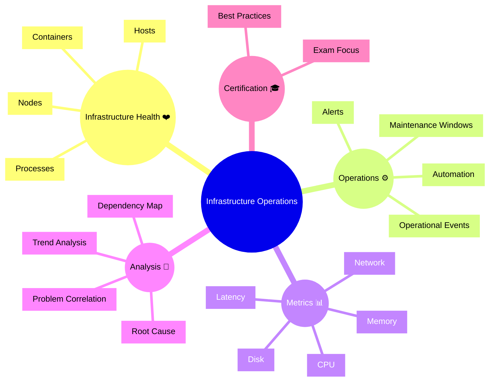

# Dynatrace Infrastructure Operations App

## Overview

The Dynatrace Infrastructure Operations app provides a centralized view of infrastructure health, performance, and operational events. In the context of the DynaTrace Associate certification, this app is important because it shows how Dynatrace monitors infrastructure operations, detects anomalies, and connects infrastructure state to service and application behavior.

## Infrastructure Operations Mindmap

## Key Concepts

- **Infrastructure Operations**: Observing the state and activity of infrastructure components while managing operational tasks and events.
- **Operational Event**: A record of configuration changes, alerts, or system activity that affects infrastructure operations.
- **Maintenance Window**: A scheduled period when planned work is expected and alerts may be managed accordingly.
- **Automation**: Configured workflow actions or alerting policies that help operational teams respond faster.
- **Operational Visibility**: The ability to see infrastructure issues, health trends, and event-driven changes in one view.

## Main Features

### Infrastructure Health Monitoring
- Tracks the health of hosts, nodes, processes, containers, and other infrastructure entities.
- Displays resource usage metrics like CPU, memory, disk, network, and latency.
- Identifies unhealthy infrastructure components and operational risks.

### Event and Alert Management
- Collects operational events from infrastructure change activity, alerts, and integrations.
- Correlates events with affected entities and problems.
- Helps operators triage the operational impact of infrastructure events.

### Maintenance and Operations Context
- Supports maintenance windows and operational workflow context.
- Lets teams distinguish planned operational activity from unexpected issues.
- Provides a record of operational actions that may impact system behavior.

### Metrics and Trending
- Monitors infrastructure performance trends over time.
- Supports capacity planning by tracking resource usage and growth patterns.
- Helps identify slow-moving degradation before it becomes an outage.

### Analysis and Correlation
- Connects infrastructure events and metrics to service problems and application incidents.
- Leverages Dynatrace AI to surface likely root causes in the infrastructure layer.
- Uses dependency mapping to understand how operations affect services.

## Typical Uses for the Associate Certification

- Understanding how infrastructure operations data feeds into overall Dynatrace observability.
- Identifying how operational events can reveal underlying infrastructure issues.
- Learning how maintenance windows and operational context are represented in Dynatrace.
- Using the Infrastructure Operations app to connect infrastructure metrics with incident response.

## Exam-Relevant Focus

- Know the role of Infrastructure Operations in monitoring infrastructure state and activity.
- Understand how operational events relate to infrastructure health and alerting.
- Be able to explain why maintenance windows matter in operational monitoring.
- Recognize that operational visibility helps distinguish planned change from incidents.
- Remember that Dynatrace correlates infrastructure operations with service and problem context.

## Best Practices

- Use Infrastructure Operations to monitor both health and operational activity.
- Review event correlation when investigating infrastructure-related incidents.
- Keep maintenance and automation context up to date to avoid alert fatigue.
- Use trending metrics for capacity planning and proactive operations.
- Link infrastructure events to affected services to speed root cause analysis.

## Summary

The Dynatrace Infrastructure Operations app is designed for operational teams who need visibility into infrastructure health, events, and changes. For the DynaTrace Associate certification, it emphasizes how infrastructure operations data supports observability, problem detection, and service impact analysis.
