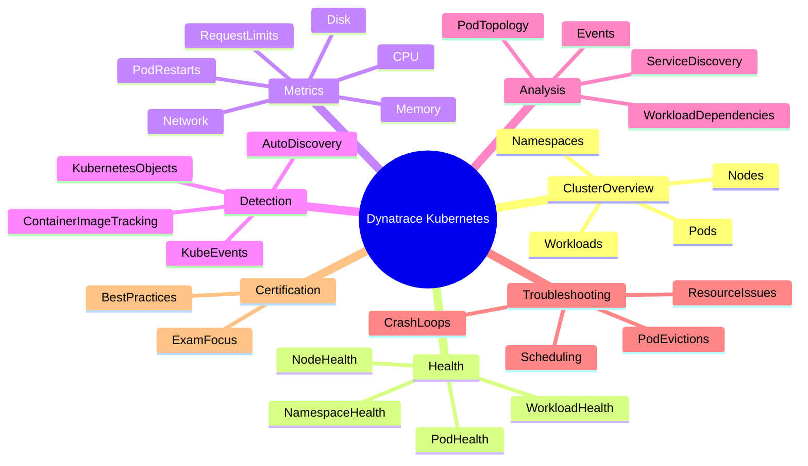

# Dynatrace Kubernetes App

## Overview

The Dynatrace Kubernetes app provides a focused view into Kubernetes clusters, namespaces, nodes, pods, and workloads. For the DynaTrace Associate certification, this app is important because it helps you understand how Kubernetes infrastructure and containers are monitored, how cluster health is assessed, and how Kubernetes-specific issues are detected.

## Kubernetes App Mindmap

## Key Concepts

- **Cluster**: The entire Kubernetes environment containing nodes, namespaces, workloads, and pods.
- **Node**: A worker machine in Kubernetes where pods are scheduled and run.
- **Namespace**: A logical partition of cluster resources used for isolation and organization.
- **Pod**: The smallest deployable unit in Kubernetes, which may contain one or more containers.
- **Workload**: A Kubernetes object such as Deployment, DaemonSet, StatefulSet, or Job that defines how pods are managed.

## Main Features

### Cluster and Namespace Visibility
- Provides a cluster-level dashboard showing overall health and resource utilization.
- Allows drill-down into namespaces to see workload distribution, pod status, and health.

### Node and Pod Monitoring
- Displays node condition, CPU, memory, and network usage.
- Monitors pod status, restart counts, and container health.
- Detects unhealthy pods, crash loops, evictions, and scheduling failures.

### Kubernetes-Specific Metrics
- Tracks container CPU and memory usage versus requested and limit values.
- Exposes pod restart counts, OOM kills, and container image statuses.
- Supports metrics for service endpoints, ingress, and network traffic.

### Automatic Detection and Context
- Dynatrace automatically discovers Kubernetes clusters, nodes, namespaces, workloads, and containers.
- Maps pods and containers to services, processes, and deployments for full-stack visibility.
- Correlates Kubernetes events, health issues, and service problems.

### Workload and Deployment Analysis
- Shows deployment and workload health across replicas and rolling updates.
- Helps understand how pod failures impact services and application availability.
- Detects and reports issues in StatefulSets, DaemonSets, and Deployments.

### Problem Detection and Root Cause
- Identifies Kubernetes-specific problems such as pod crash loops, node pressure, resource saturation, and failed deployments.
- Provides insights into whether issues are caused by infrastructure, Kubernetes orchestration, or application behavior.
- Supports impact analysis to see affected namespaces, workloads, and services.

### Filtering and Troubleshooting
- Filter by cluster, namespace, label, workload type, or node.
- Use metadata and tags to group related Kubernetes objects.
- Compare cluster and namespace metrics across time windows for trend analysis.

## Typical Uses for the Associate Certification

- Understanding how Dynatrace monitors Kubernetes clusters and workloads.
- Identifying resource and health issues in nodes, pods, and namespaces.
- Learning how Kubernetes entities map to Dynatrace monitoring objects.
- Using the app to spot container-level problems before they affect application services.
- Interpreting Kubernetes metrics and events in the context of Dynatrace problem detection.

## Exam-Relevant Focus

- Know how Dynatrace discovers and monitors Kubernetes clusters automatically.
- Understand the differences between cluster, node, namespace, pod, and workload views.
- Recognize Kubernetes-specific issues such as pod restarts, crash loops, and node pressure.
- Know that Kubernetes objects are correlated with services and processes for full-stack analysis.
- Be able to explain why cluster health and pod performance matter for application reliability.

## Best Practices

- Start with cluster overview to assess overall Kubernetes health.
- Drill into namespaces and workloads when a deployment or pod issue is suspected.
- Correlate node and pod metrics with service impact to prioritize troubleshooting.
- Use labels and metadata to filter and isolate related workloads.
- Review restart counts and resource limits when investigating container instability.

## Summary

The Dynatrace Kubernetes app is essential for understanding the operational state of Kubernetes environments in the DynaTrace Associate certification. It offers cluster-level visibility, Kubernetes-specific metrics, automatic discovery, and problem detection that link container and orchestration issues to application performance.
