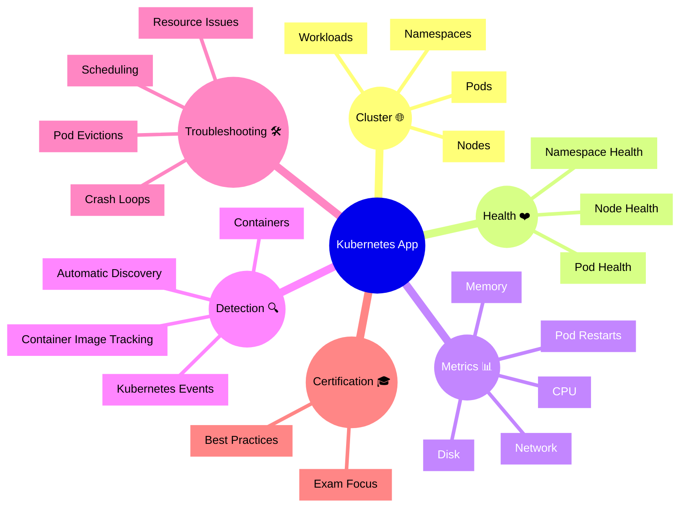

# Dynatrace Kubernetes App Flashcards

## Overview

These flashcards cover key Dynatrace Kubernetes concepts for the DynaTrace Associate certification. They include Mermaid diagrams and iconic descriptions to help memorize core ideas.

## Kubernetes Mindmap

## Flashcards

### Q: What is the Dynatrace Kubernetes app? 🧭
A: A monitoring view for Kubernetes clusters, namespaces, nodes, pods, and workloads that connects infrastructure health to application behavior.

### Q: What does Dynatrace automatically detect in Kubernetes? 🤖
A: Clusters, nodes, namespaces, workloads, pods, containers, and Kubernetes events.

### Q: What is the difference between a pod and a workload? 📦
A: A pod is the smallest deployable unit containing containers; a workload is a Kubernetes object like a Deployment or StatefulSet that manages pods.

### Q: What is a namespace? 🏷️
A: A logical partition inside a cluster used to isolate and organize Kubernetes resources.

### Q: Why are node health and pod health important? ❤️
A: They reveal whether the infrastructure and deployed containers are stable, available, and able to run workloads normally.

### Q: What Kubernetes metrics are commonly monitored? 📈
A: CPU, memory, network, disk, and pod restarts.

### Q: What is a crash loop? 🔁
A: A pod repeatedly restarting due to an application or container failure.

### Q: Why is scheduled pod placement important? 📍
A: Scheduling determines which node runs a pod; failures or evictions can indicate resource or configuration problems.

### Q: What is a Kubernetes event in Dynatrace? 🗓️
A: A record of cluster activity such as pod creation, deletion, scaling, or errors.

### Q: How does Kubernetes monitoring help with service impact? 🔗
A: It shows how cluster and pod issues affect services, helping correlate infrastructure problems with application behavior.

### Q: What is a best practice for Kubernetes troubleshooting? 🛠️
A: Start with cluster and node health, then drill into namespaces, workloads, and pod metrics to identify resource bottlenecks or failures.

### Q: What does pod restart count indicate? 🔄
A: It indicates instability in the pod, often caused by crashes, OOM kills, or readiness/liveness probe failures.

### Q: What should Associate candidates remember about Kubernetes namespaces? 📂
A: Namespaces help organize resources and narrow monitoring scope when filtering or troubleshooting.

### Q: How does Dynatrace connect Kubernetes to problems? 🚨
A: It correlates Kubernetes metrics and events with service and infrastructure issues to identify impacted applications and root causes.

### Q: What is an iconic description for Kubernetes monitoring? 🧭
A: `Kubernetes App 🌐` because it maps container orchestration health to application performance and service behavior.
