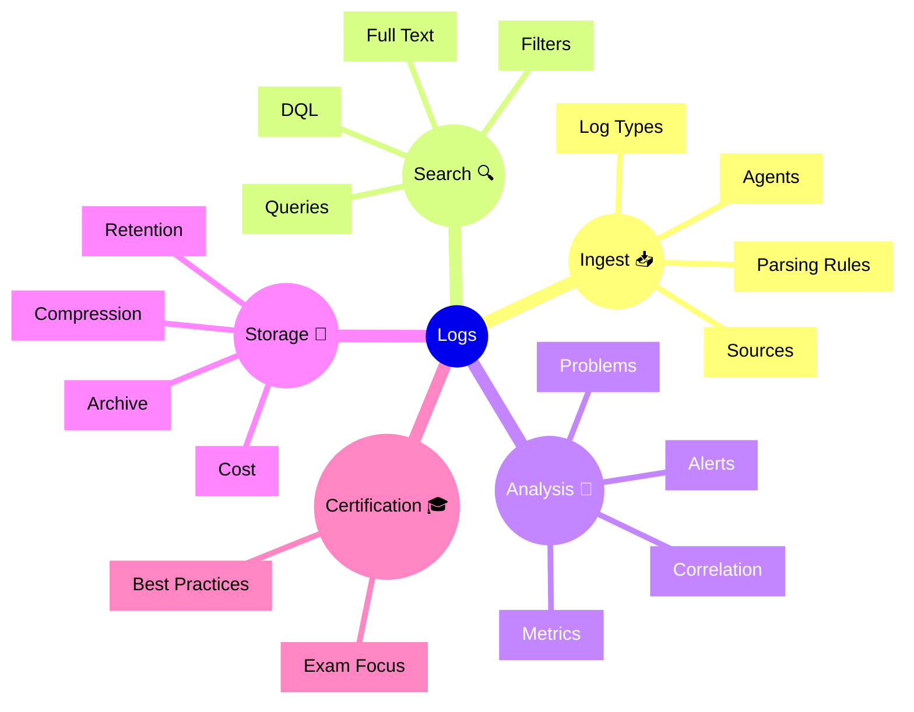

# Dynatrace Logs

## Overview

The Dynatrace Logs app provides centralized log ingest, search, and analytics. For the DynaTrace Associate certification, this app is important because it shows how logs complement metrics and traces in root cause analysis.

## Logs Mindmap

## Key Concepts

- **Logs**: Text-based records of application and system activity.
- **Ingest**: The process of collecting log data into Dynatrace.
- **Search**: Finding relevant log entries via filters, full-text search, and DQL.
- **Correlation**: Linking logs to services, traces, problems, and entities.
- **Retention**: How long logs are kept for analysis.

## Main Features

### Log Ingest
- Collects logs from multiple sources and agents.
- Supports parsing rules for structured and unstructured logs.
- Ingests application, system, and security logs.

### Search and Query
- Search logs with filters, text search, and DQL.
- Retrieve logs for specific entities, time ranges, or events.
- Use queries to investigate incidents and patterns.

### Log Analysis
- Correlate logs with traces, metrics, and problems.
- Use log context to validate root causes and incident sequences.
- Create dashboards and alerts based on log queries.

### Storage and Retention
- Manage log retention for cost and compliance.
- Store logs for historical troubleshooting and audit.
- Balance retention needs with storage costs.

## Typical Uses for the Associate Certification

- Understanding how logs are ingested and searched in Dynatrace.
- Recognizing how logs support cross-domain investigation.
- Learning when to use logs versus traces or metrics.
- Knowing the importance of log retention and correlation.

## Exam-Relevant Focus

- Know that Logs provides centralized logging with search and correlation.
- Understand how logs are linked to problems and Traces.
- Be able to explain the basics of log ingest and retention.
- Remember that log queries can feed dashboards and alerts.

## Best Practices

- Use logs to validate root cause and event sequences.
- Keep parsing and ingest rules accurate for better searchability.
- Correlate log data with service and problem context.
- Monitor log storage and retention for cost control.

## Summary

The Dynatrace Logs app brings log data into the broader observability picture. For Associate certification, it demonstrates how logs complement metrics and traces in troubleshooting and analysis.
