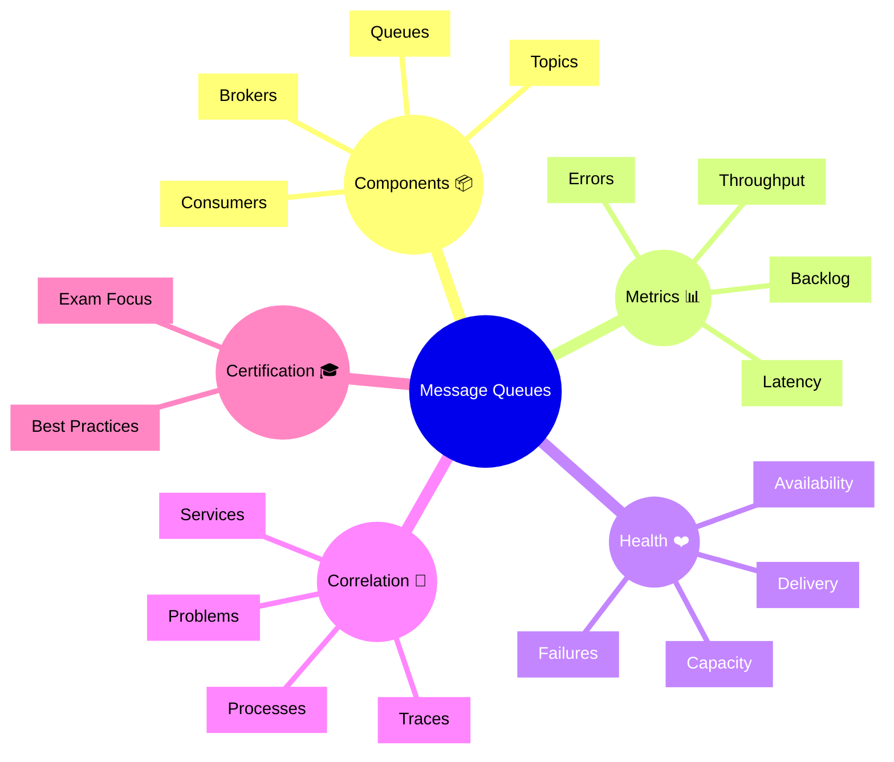

# Dynatrace Message Queues

## Overview

The Dynatrace Message Queues app tracks queues, brokers, and messaging system health. In the DynaTrace Associate certification context, this app helps you understand how messaging components affect application performance and reliability.

## Message Queues Mindmap

## Key Concepts

- **Message Queue**: A buffer that holds messages for asynchronous processing.
- **Broker**: The messaging system component that manages queues and routing.
- **Topic**: A pub/sub channel where messages are published and consumed.
- **Backlog**: The number of undelivered messages waiting in a queue.
- **Delivery Latency**: The time taken for a message to move from producer to consumer.

## Main Features

### Queue and Broker Monitoring
- Monitors queue length, consumption rate, and broker health.
- Tracks topology and relationships of messaging components.
- Displays messaging system status and availability.

### Messaging Metrics
- Measures throughput, latency, backlog, and error rates.
- Highlights slow consumers or overloaded queues.
- Detects delivery and processing issues.

### Health and Reliability
- Identifies message delivery failures, repeated retries, and stalled queues.
- Supports alerts for critical messaging problems.
- Helps ensure messaging systems support application reliability.

### Correlation and Impact
- Links message queue issues to services, processes, and traces.
- Shows how messaging problems affect application transactions.
- Supports root cause analysis for asynchronous workflows.

## Typical Uses for the Associate Certification

- Understanding how Dynatrace monitors message queue systems.
- Recognizing which messaging metrics indicate health or problems.
- Learning how queue issues impact services and transactions.
- Using message queue data to troubleshoot asynchronous failures.

## Exam-Relevant Focus

- Know that Message Queues focuses on queue health, throughput, and latency.
- Understand the difference between queues, brokers, and topics.
- Be able to explain how backlog and delivery latency affect reliability.
- Remember that messaging problems can be correlated with traces and services.

## Best Practices

- Monitor queue backlog and consumer throughput regularly.
- Correlate messaging issues with relevant service and trace data.
- Use alerts to detect overloaded or stalled queues early.
- Validate messaging system health before investigating application issues.

## Summary

The Dynatrace Message Queues app gives visibility into asynchronous messaging systems. For Associate certification, it highlights queue health, delivery metrics, and the impact of messaging on application reliability.
