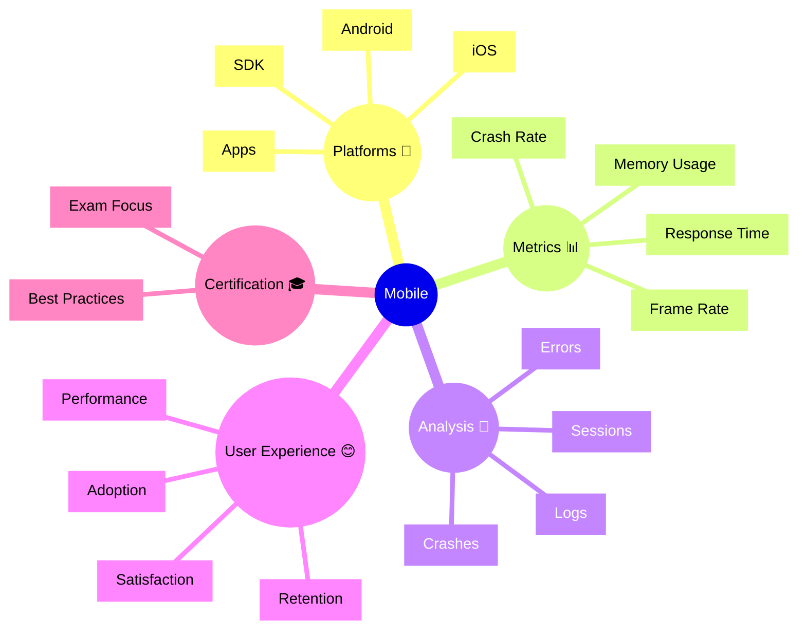

# Dynatrace Mobile

## Overview

The Dynatrace Mobile app monitors native mobile applications for performance, crashes, and user experience. For the DynaTrace Associate certification, this app is important because it shows how Dynatrace extends observability to mobile platforms.

## Mobile Mindmap

## Key Concepts

- **Mobile SDK**: The Dynatrace agent for iOS and Android applications.
- **Crash Rate**: The percentage of sessions that end with an application crash.
- **Frame Rate**: The smoothness of animation and UI rendering measured in frames per second.
- **User Session**: A mobile user's interaction sequence from app launch to close.
- **Network Performance**: Time to load data and API responses from the mobile device.

## Main Features

### Mobile Instrumentation
- Easy SDK integration for iOS and Android applications.
- Automatic capturing of crashes, errors, and performance metrics.
- Support for custom metrics and user actions.

### Session Tracking
- Records individual user sessions with timestamps and session details.
- Captures user interactions, navigation, and screen changes.
- Enables session replay and detailed user journey analysis.

### Crash Analysis
- Captures crash stack traces and crash reports.
- Groups crashes by type and frequency for prioritization.
- Links crashes to affected user populations and device types.

### Performance Monitoring
- Measures response times for API calls and network requests.
- Tracks memory usage, CPU, and battery impact.
- Identifies performance bottlenecks in mobile workflows.

### User Experience Metrics
- Tracks user satisfaction scores and adoption metrics.
- Measures user retention and feature usage.
- Analyzes user cohorts and behavior patterns.

### Error and Exception Tracking
- Captures handled exceptions and unhandled crashes.
- Provides detailed error context and breadcrumbs.
- Links mobile errors to backend services and logs.

## Typical Uses for the Associate Certification

- Understanding how Dynatrace monitors mobile applications.
- Recognizing key mobile performance metrics and user impact.
- Learning how mobile monitoring ties to overall business metrics.
- Seeing how mobile crashes and errors are tracked and prioritized.
- Understanding the role of mobile observability in digital experience.

## Exam-Relevant Focus

- Know that Dynatrace supports both iOS and Android platforms.
- Understand the importance of crash rate as a key mobile metric.
- Be able to explain how mobile monitoring complements web monitoring.
- Recognize that mobile user experience directly impacts business metrics.
- Remember that mobile errors can trigger alerts and workflows.

## Best Practices

- Instrument mobile apps with the Dynatrace SDK early in development.
- Monitor crash rates and prioritize fixes for high-impact crashes.
- Track user satisfaction alongside performance metrics.
- Correlate mobile errors with backend services for root cause analysis.
- Use mobile data to inform SLOs and user experience targets.

## Summary

Dynatrace Mobile provides comprehensive monitoring of iOS and Android applications. For Associate certification, it demonstrates how Dynatrace extends observability to mobile platforms and how mobile user experience is a critical component of overall digital experience.
