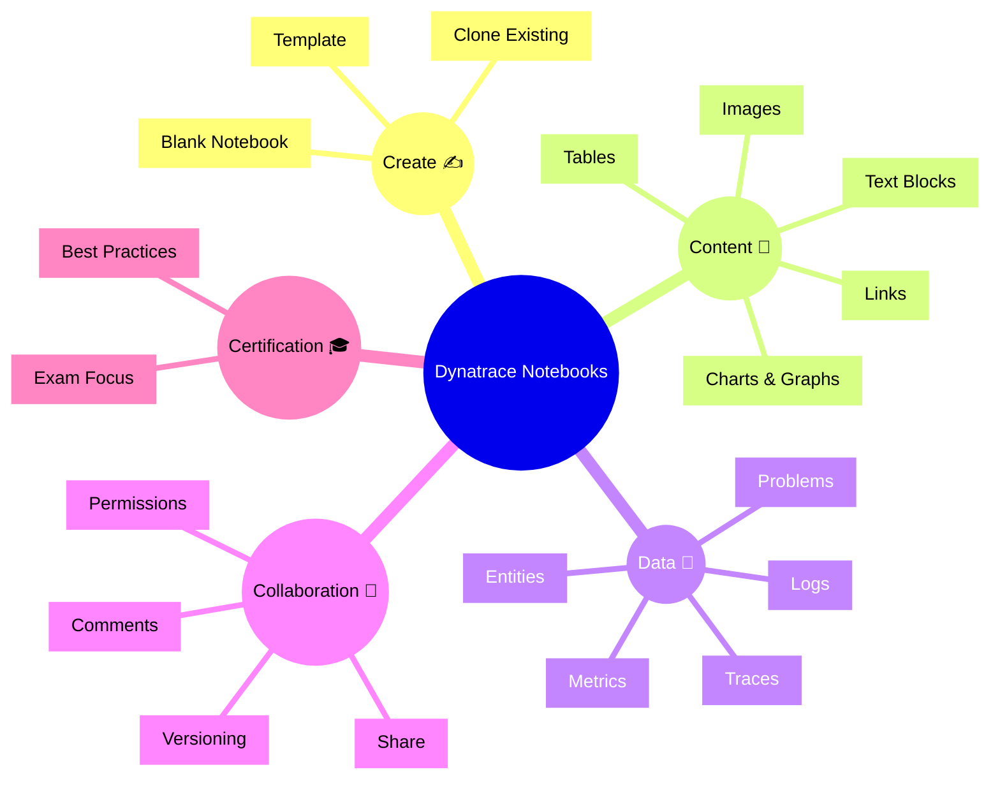

# Dynatrace Notebooks App

## Overview

The Dynatrace Notebooks app provides a collaborative environment for documenting investigations, sharing insights, and combining charts, text, and results. In the context of the DynaTrace Associate certification, this app is important because it shows how you can capture findings, support troubleshooting workflows, and share knowledge across teams.

## Notebooks App Mindmap

## Key Concepts

- **Notebook**: A flexible document that combines narrative, visualization, and Dynatrace data to support analysis and reporting.
- **Cell**: A content block inside a notebook that can include text, charts, queries, or imported data.
- **Data Block**: A visual block that pulls in Dynatrace metrics, problems, logs, or trace results.
- **Template**: A prebuilt notebook layout used to standardize investigations and share repeatable workflows.
- **Sharing**: The ability to grant access to notebooks for collaboration and review.

## Main Features

### Notebook Creation and Templates
- Start with blank notebooks or use templates for common workflows.
- Clone existing notebooks to preserve formats and adapt them for new investigations.
- Use templates to standardize incident reports and team summaries.

### Rich Content Blocks
- Combine text, headings, charts, tables, and images in a single notebook.
- Add code-like queries or data visualizations directly into notebook cells.
- Document findings, steps, and conclusions alongside live data.

### Data Integration
- Embed Dynatrace metrics, problems, logs, traces, and entities into notebook cells.
- Create visualizations from query results and dashboards for deeper analysis.
- Link notebook content directly to relevant monitored objects and problems.

### Collaboration and Sharing
- Share notebooks with colleagues for review or follow-up.
- Use permissions to control who can view or edit content.
- Keep investigation history and version context as teams update notebooks.

### Use Cases for Certification
- Document investigation steps for service, problem, or infrastructure issues.
- Capture evidence and root cause analysis in a reusable, shareable format.
- Build study notes or incident summaries for exam review.

## Typical Uses for the Associate Certification

- Using notebooks to record troubleshooting workflows during certification study.
- Creating shared investigation summaries for service, problem, or infrastructure incidents.
- Combining Dynatrace data and narrative explanation in one place.
- Reusing notebook templates for common analysis patterns.

## Exam-Relevant Focus

- Know that Notebooks are a documentation and collaboration tool within Dynatrace.
- Understand how notebooks can include Dynatrace metrics, logs, problems, and traces.
- Recognize that templates speed repeatable investigations and reporting.
- Remember that sharing and permissions help teams work together on incidents.

## Best Practices

- Use clear headings and structured text to make notebooks easy to follow.
- Embed the most relevant charts and data blocks to support conclusions.
- Keep notebooks up to date with findings and next steps.
- Share notebooks with stakeholders to preserve institutional knowledge.
- Reuse templates for recurring analysis and certification study notes.

## Summary

The Dynatrace Notebooks app is useful for documenting and sharing analysis workflows, investigation results, and study notes. For the DynaTrace Associate certification, it highlights how observability insights can be captured in a collaborative, reusable format.
