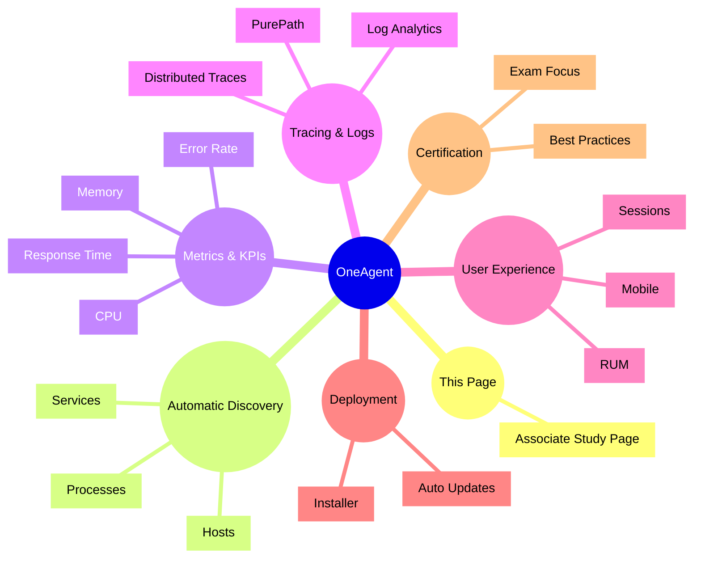

# Dynatrace OneAgent

## Overview

The Dynatrace OneAgent component is the automatic instrumentation engine that powers Dynatrace full-stack observability. For the DynaTrace Associate certification, OneAgent is essential because it delivers the foundational monitoring data for hosts, processes, services, and user experience.

## OneAgent Mindmap

## Key Concepts

- **OneAgent**: The Dynatrace agent installed on hosts or containers to automatically capture full-stack observability data.
- **Automatic instrumentation**: OneAgent discovers processes, services, and applications without manual configuration.
- **Service detection**: OneAgent identifies services and their dependencies to build service flow and topology views.
- **Metrics collection**: OneAgent captures host, process, service, and user-experience metrics by default.
- **Technology support**: OneAgent supports a wide range of technologies, including Java, .NET, Node.js, Kubernetes, and web servers.

## Main Features

### Full-stack discovery
- Automatically detects hosts, processes, containers, and services.
- Builds dependency maps and service flow diagrams from observed traffic.
- Minimizes manual setup for Associate-level monitoring.

### Process and service instrumentation
- Monitors process health, CPU, memory, and resource consumption.
- Detects service endpoints and groups related application components.
- Provides early warning of service degradation.

### Traces and logs
- Captures PurePath traces for code-level transaction analysis.
- Correlates logs, errors, and traces for faster root cause identification.
- Supports both backend and frontend transaction tracing.

### User experience data
- Collects RUM and mobile user experience metrics when enabled.
- Sends session data, page load information, and user actions to Dynatrace.
- Links frontend experience with backend performance.

### Deployment and updates
- Deploys via installer packages or container images.
- Supports automatic updates and version management.
- Centralizes agent health and upgrade status in the Dynatrace web UI.

## Typical Uses for the Associate Certification

- Understanding how Dynatrace collects monitoring data.
- Recognizing that OneAgent is the foundation of automatic observability.
- Knowing which types of entities OneAgent discovers and monitors.
- Explaining how service flow and PurePath analysis originate from OneAgent data.
- Using OneAgent to correlate infrastructure, application, and user experience issues.

## Exam-Relevant Focus

- Know that OneAgent is installed on hosts or containers and automatically discovers services.
- Understand that OneAgent provides full-stack monitoring for hosts, processes, services, and user sessions.
- Be able to explain the role of OneAgent in enabling service flow, PurePath tracing, and metric collection.
- Remember that OneAgent reduces manual instrumentation work and supports a broad technology stack.

## Best Practices

- Install OneAgent on all monitored hosts and supported containers.
- Check OneAgent deployment health and update status regularly.
- Use OneAgent to ensure consistent visibility across infrastructure and applications.
- Combine OneAgent data with RUM and synthetic metrics for end-to-end observability.

## Summary

Dynatrace OneAgent is the core component that drives automatic discovery, tracing, and full-stack monitoring. For the Associate certification, it is the starting point for understanding how Dynatrace collects and correlates observability data.