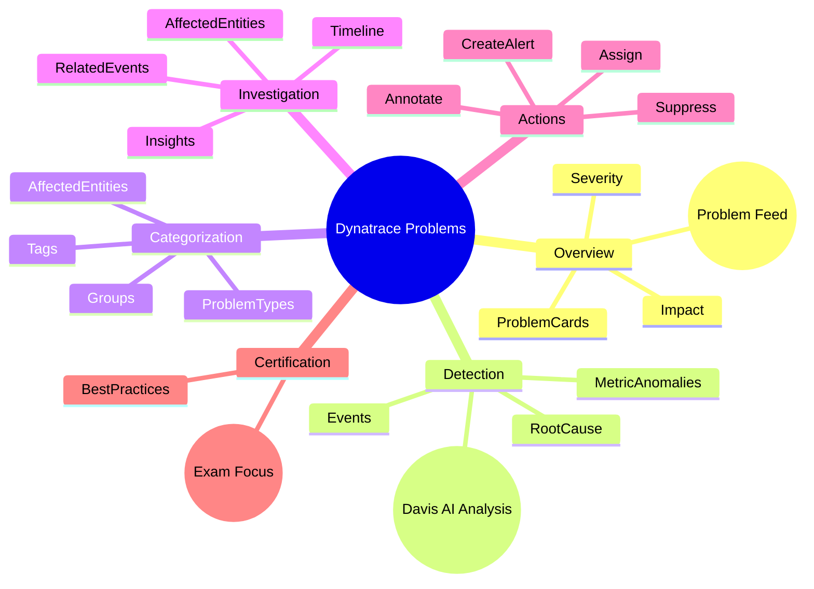

# Dynatrace Problems App

## Overview

The Dynatrace Problems app centralizes detected issues across hosts, services, applications, and infrastructure. For the DynaTrace Associate certification, this app is critical because it teaches you how Dynatrace identifies, groups, and prioritizes problems and how to use that information to troubleshoot faster.

## Problems App Mindmap

## Key Concepts

- **Problem**: A detected issue representing an event or state that can impact application or infrastructure performance.
- **Severity**: A rating that indicates how urgent or serious a problem is, often classified as severe, error, warning, or info.
- **Impact**: The scope of affected entities and users that are influenced by the problem.
- **Root Cause**: The underlying issue Dynatrace identifies as the primary cause of observed symptoms.
- **Davis AI**: Dynatrace’s AI engine that analyzes data, detects anomalies, and groups related issues into problems.

## Main Features

### Problem Feed and Overview
- Presents a centralized list of all problems detected in the monitored environment.
- Displays key problem details such as severity, affected entities, impact, and status.
- Lets you sort and filter problems by time, severity, entity type, or status.

### Automatic Detection and AI Correlation
- Uses Davis AI to detect anomalies, root causes, and related events.
- Groups multiple symptoms into a single problem when they are related.
- Correlates metrics, logs, traces, and events to reduce noise.

### Problem Details and Root Cause
- Provides a detailed problem page with timeline, related events, and impact information.
- Identifies root causes by analyzing dependencies and anomalies across the stack.
- Shows affected hosts, services, applications, processes, and custom entities.

### Impact and Affected Entities
- Quantifies how many hosts, services, or users are impacted by the problem.
- Highlights dependencies and downstream systems affected by the issue.
- Helps prioritize remediation based on customer impact.

### Problem Classification and Filtering
- Categorizes problems by type, source, and affected entity.
- Enables filtering by problem status, severity, entity type, and tags.
- Supports custom tags for grouping and analysis.

### Operations and Collaboration
- Allows problem assignment, annotation, suppression, and resolution.
- Supports sending alerts or creating tickets from problem details.
- Enables team collaboration through shared problem context and event history.

## Typical Uses for the Associate Certification

- Understanding how Dynatrace surfaces and prioritizes issues.
- Identifying the difference between raw alerts and enriched problems.
- Learning how root-cause analysis is presented and used.
- Using the problem timeline and event correlation to investigate incidents.
- Recognizing why problem impact is important for troubleshooting.

## Exam-Relevant Focus

- Know that Dynatrace groups related anomalies into problems using Davis AI.
- Understand what severity, impact, and affected entities mean in the Problems app.
- Be able to describe how the problem details page supports root cause analysis.
- Recognize how filtering and sorting helps triage issues.
- Remember that automated problem detection reduces alert noise and helps focus on business impact.

## Best Practices

- Start with the problem feed to see current system health at a glance.
- Use problem details and root cause information to avoid chasing symptoms.
- Pay attention to affected entities and impact when prioritizing issues.
- Use filters and tags to focus on relevant problem categories.
- Resolve or suppress problems only after confirming the cause and documenting the fix.

## Summary

The Dynatrace Problems app is essential for associate-level troubleshooting and incident management. It provides AI-driven issue detection, impact analysis, root cause insights, and a unified workflow for examining and remediating problems in the monitored environment.
