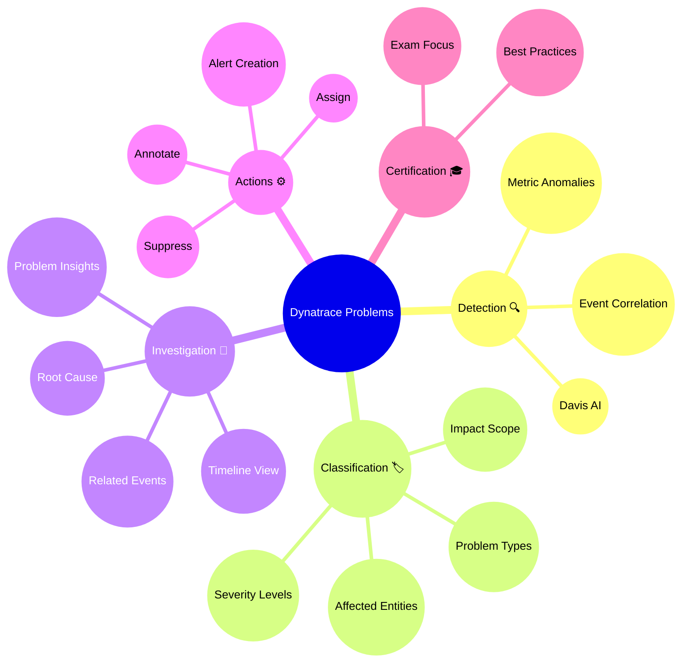

# Dynatrace Problems App Flashcards

## Overview

These flashcards help reinforce key Dynatrace Problems App concepts for the DynaTrace Associate certification. Each card includes iconic descriptions and Mermaid diagrams for visual learning.

## Mermaid Mindmap

## Flashcards

### Q: What does the Dynatrace Problems app do?
A: It centralizes detected issues across the environment, groups related alerts into problems, and helps identify root causes using AI-driven correlation.

### Q: Why is Dynatrace Problems important for the Associate exam?
A: It teaches how Dynatrace reduces noise, shows impact, and provides a clear starting point for troubleshooting service and infrastructure issues.

### Q: What is a problem severity level?
A: A rating that indicates how critical an issue is, such as severe, error, warning, or info.

### Q: What does impact describe in a problem?
A: The scope of affected entities and users, helping prioritize problems based on business or operational impact.

### Q: What role does Davis AI play in the Problems app?
A: It analyzes metrics, logs, traces, and events to detect anomalies, group related symptoms, and identify probable root causes.

### Q: How does the Problems app group issues?
A: It correlates related symptoms into a single problem, preventing duplicate noise and making it easier to investigate an incident.

### Q: What is the problem timeline used for?
A: To show when events occurred, how the issue evolved, and the sequence of related activities during the incident.

### Q: What is a root cause in Dynatrace Problems?
A: The underlying issue identified by Dynatrace that is most likely responsible for the observed symptoms.

### Q: What entities can be affected by a problem?
A: Hosts, services, applications, processes, containers, custom entities, and user sessions.

### Q: What is a common best practice for using the Problems app?
A: Start with the problem feed and use severity + impact to prioritize the investigation, then follow the root cause and related events.

### Q: What does problem suppression do?
A: It hides known or acceptable issues from the active problem feed to reduce noise while keeping the issue documented.

### Q: How can problems be shared or actioned?
A: By assigning problems to team members, annotating with notes, creating alerts, or linking them to incident management workflows.

### Q: What is an example of an iconic description for a problem?
A: `Severity 🔥` for urgent issues and `Impact 🌐` for broad service or user effects.

### Q: How should an Associate candidate describe problem filtering?
A: Use filters by severity, status, entity type, and tags to narrow the problem feed to relevant incidents.

### Q: What is the advantage of AI grouping in Dynatrace Problems?
A: It reduces the number of alerts and helps teams focus on the most meaningful, high-impact issues.
