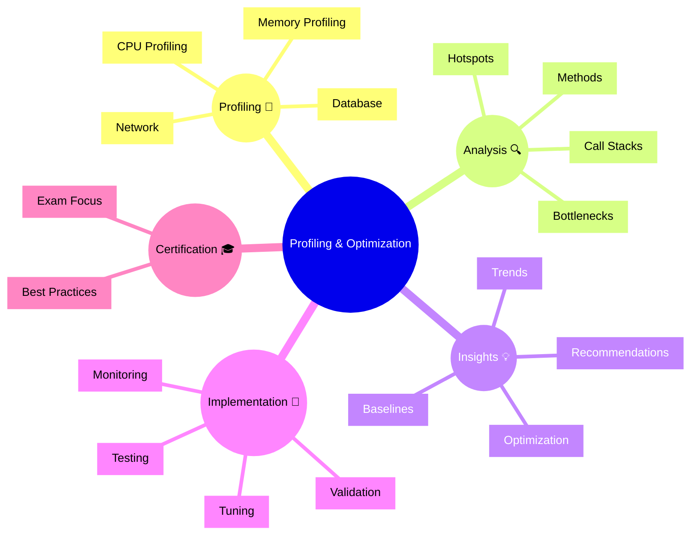

# Dynatrace Profiling & Optimization

## Overview

The Dynatrace Profiling & Optimization app analyzes code execution to identify performance bottlenecks and optimization opportunities. For the DynaTrace Associate certification, this app is important because it shows how Dynatrace enables deep code-level performance analysis.

## Profiling & Optimization Mindmap

## Key Concepts

- **Profiling**: Analyzing code execution to measure performance characteristics.
- **CPU Profiling**: Measuring which methods consume the most CPU time.
- **Memory Profiling**: Analyzing memory allocation, usage, and garbage collection.
- **Hotspot**: A function or code section that consumes a disproportionate amount of resources.
- **Call Stack**: The sequence of method calls leading to the current execution point.

## Main Features

### CPU Profiling
- Identifies methods that consume the most CPU time.
- Shows call stacks and execution frequencies.
- Helps locate performance bottlenecks in CPU-intensive code.

### Memory Analysis
- Tracks memory allocation and object lifecycles.
- Identifies memory leaks and excessive allocations.
- Shows garbage collection impact on performance.

### Database Profiling
- Analyzes database query execution and timing.
- Identifies slow queries and inefficient access patterns.
- Shows database contribution to overall latency.

### Hotspot Detection
- Automatically identifies performance-critical code sections.
- Highlights methods with the highest performance impact.
- Prioritizes optimization efforts.

### Optimization Recommendations
- Suggests specific code improvements based on profiling data.
- Recommends caching, algorithm changes, or resource pooling.
- Provides context and impact estimates for recommendations.

### Performance Baselines and Trending
- Establishes performance baselines for comparison.
- Tracks optimization progress over time.
- Detects performance regressions.

## Typical Uses for the Associate Certification

- Understanding how Dynatrace profiles code performance.
- Recognizing hotspots and performance bottlenecks.
- Learning how to use profiling data for optimization.
- Seeing how profiling supports performance SLOs.
- Understanding the role of code-level monitoring in observability.

## Exam-Relevant Focus

- Know that Profiling & Optimization focuses on code-level performance.
- Understand the difference between CPU and memory profiling.
- Be able to explain how hotspot detection helps prioritization.
- Recognize that profiling data can guide optimization efforts.
- Remember that profiling is complementary to runtime monitoring.

## Best Practices

- Use profiling data to guide optimization efforts on high-impact code.
- Correlate profiling results with user-facing performance metrics.
- Establish baseline metrics before and after optimizations.
- Monitor for performance regressions after code changes.
- Prioritize optimizations that have the largest impact on user experience.

## Summary

Dynatrace Profiling & Optimization provides code-level performance analysis and optimization recommendations. For Associate certification, it demonstrates how deep code profiling complements runtime monitoring to enable comprehensive performance optimization.
