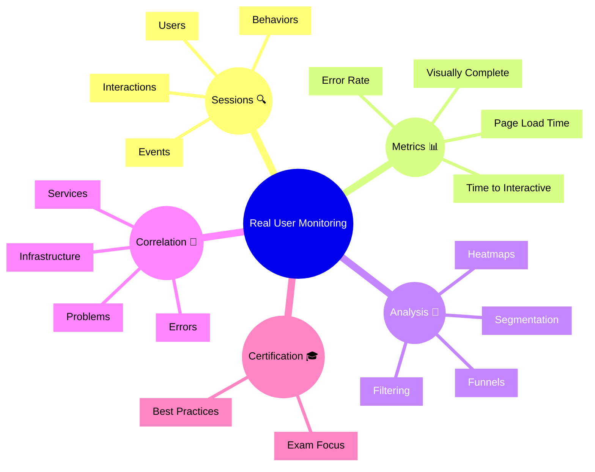

# Dynatrace Real User Monitoring

## Overview

The Dynatrace Real User Monitoring (RUM) app captures and analyzes user interactions with web and mobile applications. For the DynaTrace Associate certification, this app is important because it shows how Dynatrace monitors real user experience from the client side.

## Real User Monitoring Mindmap

## Key Concepts

- **Session**: A recorded sequence of user interactions with an application.
- **Real User**: Actual end users interacting with the application in production.
- **Page Load Time**: The time it takes for a web page to fully load and become interactive.
- **Visually Complete**: The time when all visual elements are rendered on the page.
- **Core Web Vitals**: Browser metrics such as LCP, CLS, and INP that describe page speed, visual stability, and responsiveness.
- **User Behavior**: The pattern of user actions and navigation through the application.

## Main Features

### Session Tracking
- Captures individual user sessions with timestamps and session IDs.
- Records user interactions such as clicks, page views, and form submissions.
- Enables replay and detailed analysis of user behavior.

### Performance Metrics
- Measures page load time, visually complete time, and time to interactive.
- Measures Core Web Vitals such as Largest Contentful Paint (LCP), Cumulative Layout Shift (CLS), and Interaction to Next Paint (INP) to help quantify user experience quality.
- Tracks resource timings for JavaScript, stylesheets, and images.
- Identifies slow or failing resource loads that impact user experience.

### User Segmentation and Analysis
- Filters sessions by geography, device type, browser, or custom attributes.
- Analyzes user cohorts to identify patterns and trends.
- Supports cohort analysis and user journey visualization.

### Funnel Analysis
- Tracks user flows through critical business steps or navigation paths.
- Identifies where users drop off or abandon transactions.
- Helps prioritize improvements to high-impact user flows.

### Correlation with Backend
- Links user session data to related services and infrastructure.
- Shows how backend issues impact real user experience.
- Correlates frontend errors with backend problems and logs.

### Error Tracking
- Captures JavaScript errors, network errors, and API failures seen by users.
- Groups errors by type and frequency for prioritization.
- Supports drill-down into error details and affected sessions.

## Typical Uses for the Associate Certification

- Understanding how Dynatrace captures real user experience data.
- Recognizing key RUM metrics that indicate user satisfaction.
- Learning how to correlate frontend issues with backend services.
- Using session analysis to troubleshoot user-reported problems.
- Seeing how RUM data feeds into business metrics and SLOs.

## Exam-Relevant Focus

- Know that RUM captures real user interactions from the client side.
- Understand the difference between page load time and visually complete time.
- Be able to explain how RUM metrics relate to user satisfaction.
- Know the meaning of Core Web Vitals such as LCP, CLS, and INP and how they reflect web experience quality.
- Recognize that RUM is essential for digital experience monitoring.
- Remember that RUM data can be correlated with service and infrastructure issues.

## Best Practices

- Use RUM to establish user experience baselines and SLOs.
- Filter sessions by relevant dimensions to identify specific user groups with issues.
- Investigate high-impact error types that affect many users.
- Correlate frontend issues with backend data to find root causes.
- Monitor RUM metrics as a primary indicator of application health.

## Related Links
- [What is AppDex](https://raygun.com/blog/apdex-score-guide/)
- [AppDex Guide](https://raygun.com/blog/apdex-score-guide/)
- [Core Web Vitals overview](https://web.dev/vitals/)
- [Largest Contentful Paint (LCP)](https://web.dev/lcp/)
- [Cumulative Layout Shift (CLS)](https://ahrefs.com/blog/cumulative-layout-shift-cls/)
- [Interaction to Next Paint (INP)](https://web.dev/inp/)
- [User Sessions](https://docs.dynatrace.com/docs/observe/digital-experience/rum-concepts/user-session)

## Summary

Dynatrace Real User Monitoring provides visibility into actual user experience through session tracking, performance metrics, and user behavior analysis. For Associate certification, it demonstrates how frontend monitoring contributes to overall observability and business impact assessment.
