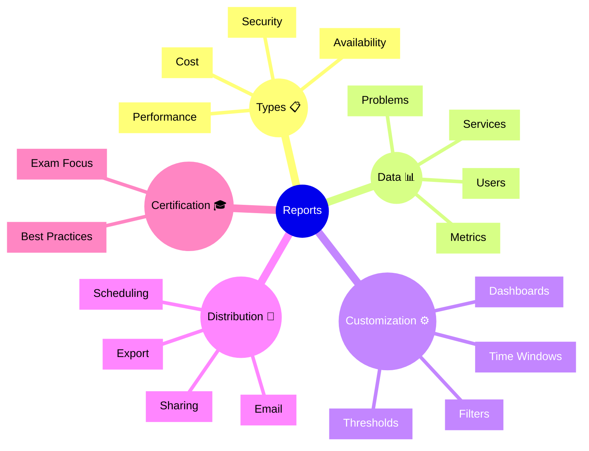

# Dynatrace Reports

## Overview

The Dynatrace Reports app creates and manages custom reports on application and infrastructure performance. For the DynaTrace Associate certification, this app is important because it shows how to communicate observability insights to stakeholders and support compliance and auditing.

## Reports Mindmap

## Key Concepts

- **Report**: A compiled view of observability data for communication and analysis.
- **Performance Report**: Summary of service and application performance metrics.
- **Availability Report**: Tracking of uptime and reliability metrics against SLOs.
- **Cost Report**: Analysis of infrastructure and licensing costs.
- **Report Scheduling**: Automated generation and distribution at regular intervals.

## Main Features

### Report Templates
- Pre-built report templates for common use cases.
- Templates for performance, availability, cost, and security.
- Easy customization for specific business needs.

### Data Aggregation
- Combines metrics, problems, events, and logs into comprehensive reports.
- Supports filtering by service, environment, or custom criteria.
- Aggregates data across time windows for trend analysis.

### Customization Options
- Choose which metrics and visualizations to include.
- Set thresholds for highlighting problematic areas.
- Define time windows and comparison periods.

### Visualization
- Charts, graphs, and tables for easy data interpretation.
- Trend analysis showing historical performance.
- Executive summaries for non-technical audiences.

### Scheduling and Distribution
- Automatically generates reports on a schedule.
- Distributes reports via email or direct access links.
- Supports export in multiple formats (PDF, Excel, etc.).

### Stakeholder Communication
- Tailored reports for executives, operations teams, and developers.
- Key metrics highlighted for different audiences.
- Supports SLO compliance reporting and audit trails.

## Typical Uses for the Associate Certification

- Understanding how Dynatrace reports communicate observability insights.
- Recognizing how reports support stakeholder communication.
- Learning how reports track compliance with SLOs.
- Seeing how reports can highlight trends and issues.
- Understanding the role of reports in operational governance.

## Exam-Relevant Focus

- Know that Reports app provides scheduled reporting on performance and availability.
- Understand the importance of customizable reports for different audiences.
- Be able to explain how reports support SLO compliance communication.
- Recognize that reports can highlight problems and trends.
- Remember that reports are a key tool for non-technical stakeholder communication.

## Best Practices

- Create specific reports for each stakeholder group (executives, ops, developers).
- Schedule reports to arrive before important meetings or reviews.
- Use reports to track SLO compliance and highlight areas needing improvement.
- Combine historical data with current trends to show progress.
- Share reports widely to promote observability awareness across teams.

## Summary

Dynatrace Reports provides scheduled reporting and communication of observability insights. For Associate certification, it demonstrates how to translate technical monitoring data into actionable insights for stakeholders and support compliance and governance.
