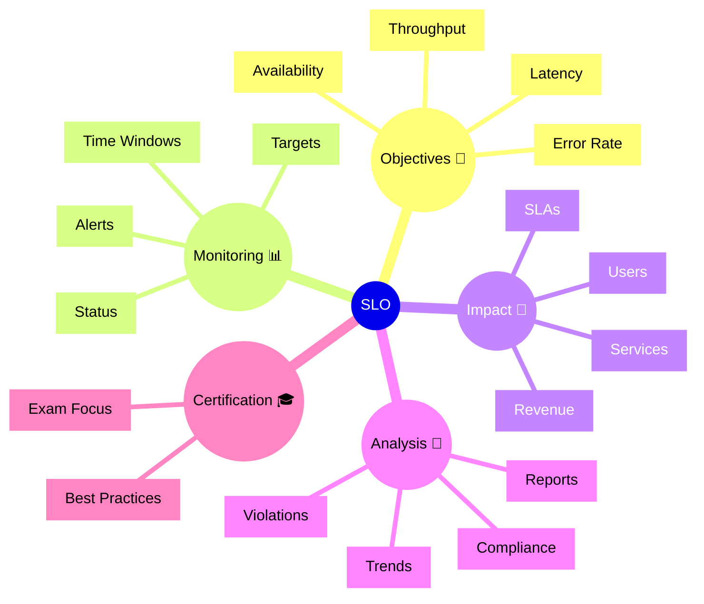

# Dynatrace SLO

## Overview

The Dynatrace SLO app tracks Service Level Objectives and helps teams measure whether services meet their reliability targets. For the DynaTrace Associate certification, this app is important because it shows how service performance is aligned with business expectations.

## SLO Mindmap

## Key Concepts

- **SLO**: A defined performance or reliability target for a service.
- **Service Level Indicator (SLI)**: The measured metric used to judge an SLO.
- **Target**: The acceptable threshold for the SLO.
- **Time Window**: The period over which the SLO is measured.
- **Violation**: When the measured value falls below the SLO target.

## Main Features

### SLO Definition
- Define objectives for availability, latency, errors, or throughput.
- Set targets and measurement windows.
- Associate SLOs with specific services or business flows.

### Monitoring and Alerts
- Track SLO compliance in real time.
- Receive alerts when SLO targets are at risk or violated.
- Monitor status across service portfolios.

### Business Alignment
- Connect performance targets to users and business impact.
- Use SLOs to communicate reliability expectations.
- Drive improvement efforts around user experience and uptime.

### Reporting and Trends
- Report SLO compliance over time.
- Analyze trends and evaluate whether service health is improving.
- Use SLO results to inform post-incident reviews.

## Typical Uses for the Associate Certification

- Understanding how Dynatrace measures service reliability against objectives.
- Recognizing the role of SLIs and targets in SLO monitoring.
- Learning when SLO violations trigger alerts and action.
- Seeing how SLOs connect service behavior to business expectations.

## Exam-Relevant Focus

- Know that SLOs are reliability targets tied to services or business outcomes.
- Understand the difference between SLO, SLI, and SLA.
- Be able to explain how compliance is measured over a time window.
- Remember that SLO alerts indicate risk to service reliability.

## Best Practices

- Define SLOs for the most critical services first.
- Keep SLO targets realistic and aligned with business needs.
- Use trend analysis to improve reliability over time.
- Respond quickly to violations and investigate root causes.

## Summary

Dynatrace SLO helps teams measure and manage reliability goals. For Associate certification, it reinforces how observability data supports service-level commitments and business impact.
