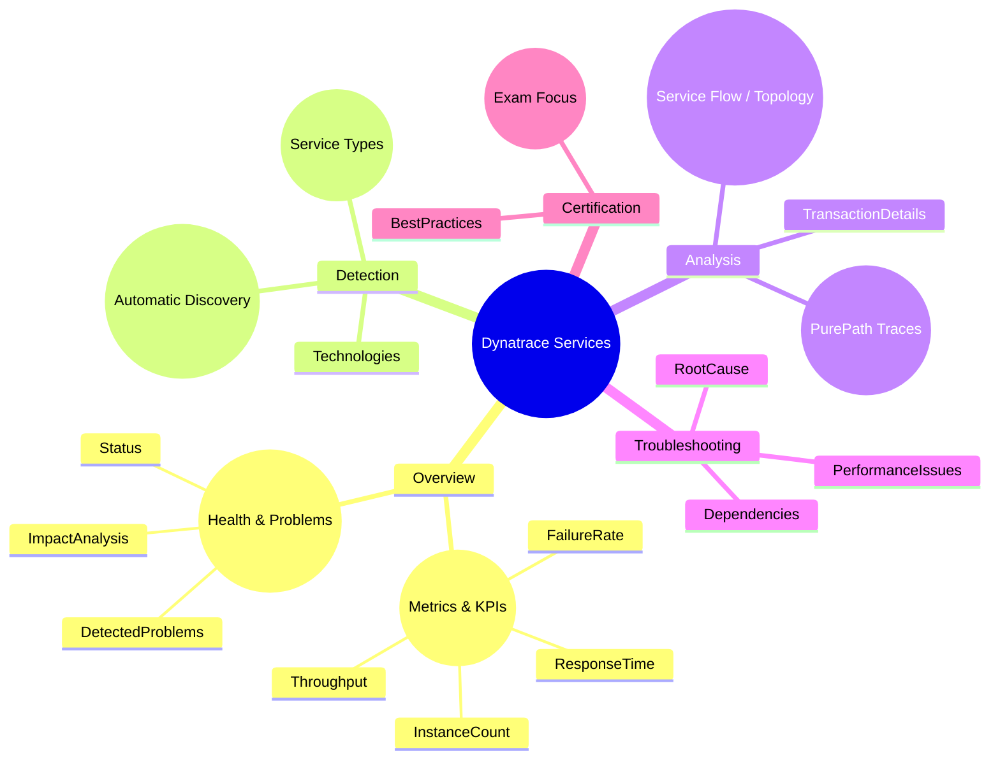

# Dynatrace Services App

## Overview

The Dynatrace Services app is a core monitoring workspace for understanding how services behave in an application environment. For the DynaTrace Associate certification, this app is important because it helps you identify service-level performance issues, dependencies, and root causes.

## Services App Mindmap

## Key Concepts

- **Service**: A logically grouped set of endpoints or code components that perform a specific function.
- **Service Instance**: An individual execution instance of a service, such as a single process or container.
- **Service Flow / Topology**: Visual representation of how services call one another.
- **Service Overview Page**: Central page that aggregates key metrics, traces, and problems for a selected service.
- **PurePath**: Distributed trace that shows the exact transaction path through services.

## Main Features

### Automatic Service Detection
- Dynatrace discovers services automatically using OneAgent instrumentation and supported technologies.
- The Services app categorizes services by type (e.g. web service, database service, custom service).

### Service Overview and Health
- Displays critical metrics such as response time, failure rate, throughput, and CPU usage.
- Shows health status and detected problems for the selected service.
- Provides a quick view of activity, impact, and error rates.

### Service Flow and Dependencies
- Visualizes the inbound and outbound service calls.
- Helps identify direct and indirect dependencies between services.
- Useful for spotting cascading failures or performance bottlenecks.

### Transaction Analysis and Traces
- Offers access to transaction details and PurePath traces for requests handled by the service.
- Enables drilling into slow or failed requests to find code-level root causes.
- Supports filtering by request type, response time, or error details.

### Problem Detection and Root Cause
- Highlights detected problems that affect service performance.
- Correlates problems with service metrics, events, and dependencies.
- Supports impact analysis to determine which services are affected.

### Service Metrics and KPIs
- Response time (average, 90th percentile, peak)
- Failure rate and error count
- Throughput / requests per minute
- Service instance count
- Resource consumption when available (CPU, memory)

### Filtering and Analysis
- Filter services by technology, tag, environment, or custom naming.
- Compare service metrics across time windows.
- Use service tags and metadata to group related services.

## Typical Uses for the Associate Certification

- Identifying the service that is causing slow response times.
- Viewing service health and understanding what metrics matter for service quality.
- Analyzing inbound and outbound service connections to pinpoint dependencies.
- Using service traces and transaction details to locate root causes.
- Recognizing how Dynatrace detects and presents service performance problems.

## Exam-Relevant Focus

- Know where to find the Services app in the Dynatrace menu.
- Understand the difference between service metrics and service problems.
- Be able to explain how service flow helps troubleshoot dependencies.
- Recognize that Dynatrace automatically detects services and tracks health.
- Remember that PurePaths are used to inspect individual transactions for a service.

## Best Practices

- Start troubleshooting from the service overview for a fast health check.
- Use service flow diagrams to verify whether service calls align with expected architecture.
- Drill into problematic service traces when metrics alone do not explain an issue.
- Use service tags to organize and search for grouped services effectively.

## Summary

The Dynatrace Services app is essential for monitoring the health and performance of services. It provides automatic discovery, service topology, metrics, detected problems, and transaction-level traces, all of which are key topics for the DynaTrace Associate certification.
