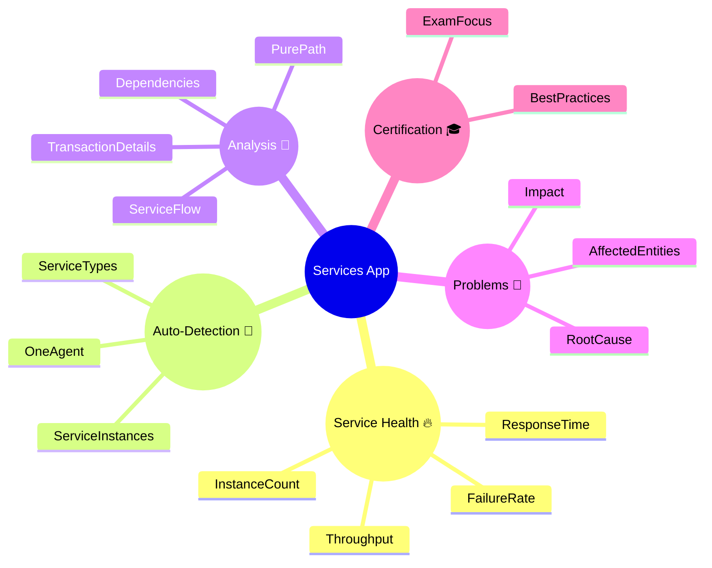

# Dynatrace Services App Flashcards

## Flashcards for DynaTrace Associate Certification

### Dynatrace Services Mindmap

### Q: What is the Dynatrace Services app? 🧭
A: A workspace that shows service-level health, performance, dependencies, and transaction details for detected services.

### Q: What is a service in Dynatrace? 🧩
A: A logically grouped application component or endpoint group automatically detected by OneAgent.

### Q: What is service flow or topology? 🌐
A: A visual map of inbound and outbound calls showing how services communicate and depend on each other.

### Q: Why is the Services app important for troubleshooting? 🛠️
A: It helps locate service bottlenecks, errors, and dependency issues so you can pinpoint root causes.

### Q: What are common service metrics shown in the Services app? 📊
A: Response time, failure rate, throughput, instance count, and resource consumption.

### Q: What is a PurePath in Dynatrace? 🧵
A: A distributed trace showing the exact execution path of a request across services and processes.

### Q: What is the service overview page? 📌
A: The central page for a selected service that displays metrics, health, detected problems, and transaction insights.

### Q: How does Dynatrace detect services? 🤖
A: Automatically via OneAgent instrumentation and supported technologies, grouping related endpoints and processes.

### Q: What problem information does the Services app show? 🚨
A: Health status, detected problems, impact, affected entities, and links to root cause analysis.

### Q: How are dependencies useful in the Services app? 🔗
A: They reveal cascading failures and identify which services may be affected by upstream or downstream issues.

### Q: What is a service instance? 🖥️
A: A single running copy of a service, such as a process, container, or server instance.

### Q: What should Associate certification candidates remember about service filtering? 🎯
A: Use technology, tags, environments, and naming to narrow service lists and find relevant components.

### Q: What makes a service problem high priority? ⚠️
A: High severity, broad impact, and a significant effect on user experience or key application functions.

### Q: How can service traces help with root cause analysis? 🔍
A: By showing slow or failing requests and the exact service call sequence leading to the issue.

### Q: What is a best practice for using the Services app? ✅
A: Start with service health and flow, then drill into problematic services and PurePath traces to find the cause.
