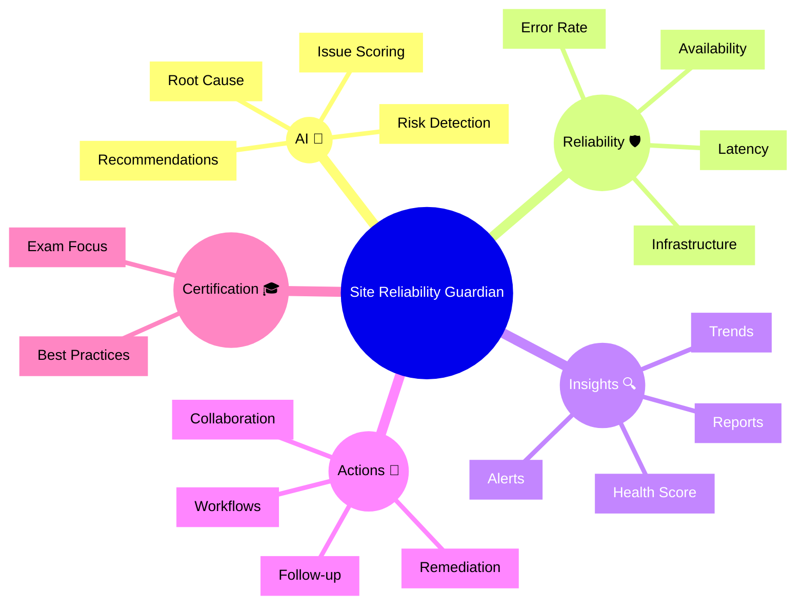

# Dynatrace Site Reliability Guardian

## Overview

Dynatrace Site Reliability Guardian is an AI-powered app that helps teams detect reliability risks and suggest remediation actions. In the DynaTrace Associate certification context, this app highlights how AI, automation, and proactive reliability monitoring come together.

## Site Reliability Guardian Mindmap

## Key Concepts

- **Site Reliability Guardian**: A Dynatrace feature that continuously evaluates reliability risks.
- **Risk Detection**: Identifies conditions that may impact availability or performance.
- **Issue Scoring**: Ranks problems by urgency and potential user impact.
- **Root Cause**: Highlights the likely source of an issue.
- **Recommendations**: Suggests actions to resolve or mitigate reliability risks.

## Main Features

### Proactive Risk Detection
- Continuously scans services and infrastructure for reliability issues.
- Detects emerging risks before they become outages.
- Uses AI to understand complex dependencies.

### Reliability Insights
- Provides health scores and trend information.
- Highlights problematic areas across services and infrastructure.
- Measures availability, error rates, and latency.

### Actionable Recommendations
- Suggests remediation actions based on identified risks.
- Links risks to workflows, tickets, or operational playbooks.
- Helps teams prioritize fixes with the greatest impact.

### Collaboration and Follow-up
- Tracks risk resolution progress.
- Enables collaboration between SRE and operations teams.
- Supports recurring review of reliability posture.

## Typical Uses for the Associate Certification

- Understanding how AI can support site reliability.
- Recognizing the difference between reactive problems and proactive risk detection.
- Learning how Guardian translates risk into actions.
- Seeing how reliability insights support business-critical operations.

## Exam-Relevant Focus

- Know that Site Reliability Guardian uses AI to detect reliability risks.
- Understand that it prioritizes issues by impact and urgency.
- Be able to explain how recommendations help teams respond.
- Remember that Guardian is about proactive reliability, not just reactive alerting.

## Best Practices

- Use Guardian to proactively identify reliability trends.
- Review recommendations and integrate them into workflows.
- Treat Guardian insights as a complement to problem detection.
- Validate reliability improvements with follow-up checks.

## Summary

Dynatrace Site Reliability Guardian provides AI-driven reliability monitoring and recommendations. For Associate certification, it emphasizes proactive observability, risk scoring, and operational readiness.
