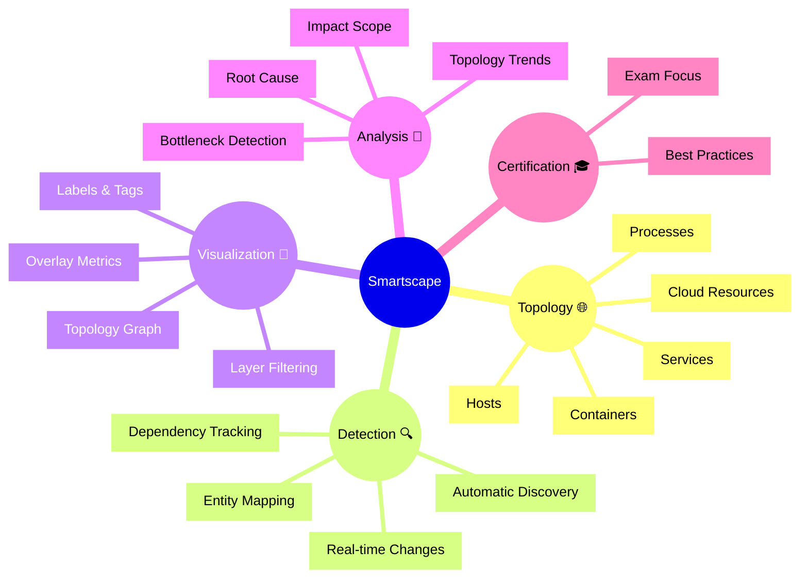

# Dynatrace Smartscape

## Overview

The Dynatrace Smartscape app provides a dynamic topology view of the monitored environment, including services, processes, hosts, containers, and cloud resources. For the DynaTrace Associate certification, this app is important because it helps you understand how Dynatrace maps dependencies, visualizes real-time relationships, and surfaces infrastructure and application context.

## Smartscape Mindmap

## Key Concepts

- **Smartscape**: A real-time, multi-layer topology map of your Dynatrace-monitored environment.
- **Entity**: Any monitored object in Dynatrace, such as a service, process, host, container, or cloud component.
- **Dependency**: A relationship between entities that shows which components communicate with or rely on one another.
- **Topology Graph**: The visual display of entities and dependencies in the Smartscape app.
- **Layer Filtering**: The ability to isolate services, hosts, containers, or other entities for focused analysis.

## Main Features

### Real-Time Topology Mapping
- Displays all monitored entities and their dependencies automatically.
- Reflects changes in the environment instantly as services and hosts appear or disappear.
- Helps you see the full communication paths from services to infrastructure.

### Dependency Visibility
- Shows inbound and outbound dependencies for services, processes, and hosts.
- Lets you identify critical upstream and downstream systems quickly.
- Supports understanding of how traffic flows through the monitored stack.

### Multi-Layer View
- Visualizes different layers of the environment, including services, processes, hosts, and containers.
- Allows toggling between layer views for clearer analysis of complex architectures.
- Supports drill-down from a high-level service map to underlying infrastructure.

### Entity and Tag Filtering
- Filters Smartscape by entity type, tags, technology, or environment.
- Uses metadata to group and highlight related components.
- Makes it easier to isolate specific application areas or team-owned infrastructure.

### Problem and Impact Analysis
- Integrates with Dynatrace problems to show affected entities in the topology.
- Uses impact visualization to highlight which services and hosts are affected.
- Supports faster root cause analysis by connecting problems to dependencies.

### Hybrid and Cloud Support
- Includes cloud services, containers, hosts, and on-premise resources in the same map.
- Supports hybrid environments and multi-cloud architectures.
- Helps visualize how cloud and infrastructure components interact with application services.

## Typical Uses for the Associate Certification

- Understanding how Dynatrace builds a live dependency map of an environment.
- Identifying which services and hosts are connected and how they interact.
- Using Smartscape to see the impact of problems on services and infrastructure.
- Learning how entity relationships help with root cause analysis.

## Exam-Relevant Focus

- Know that Smartscape provides automatic discovery and topology visualization.
- Understand the difference between entities and dependencies.
- Be able to explain how Smartscape supports real-time incident analysis.
- Recognize that filtering and tagging help isolate relevant topology segments.
- Remember that Smartscape links problems and impact to the mapped topology.

## Best Practices

- Start troubleshooting with Smartscape to get a quick topology overview.
- Use layer filtering to focus on services, hosts, or containers as needed.
- Follow dependency paths to understand the scope of an issue.
- Combine Smartscape with problems and logs for deeper analysis.
- Keep entity tagging consistent to simplify topology filtering.

## Summary

Dynatrace Smartscape is a powerful topology visualization tool that shows how monitored entities relate and interact. For the DynaTrace Associate certification, it highlights the importance of automatic discovery, dependency mapping, and real-time infrastructure context.

## Related Resources
- [Visualize your environment topology through Smartscape](https://docs.dynatrace.com/docs/shortlink/smartscape)