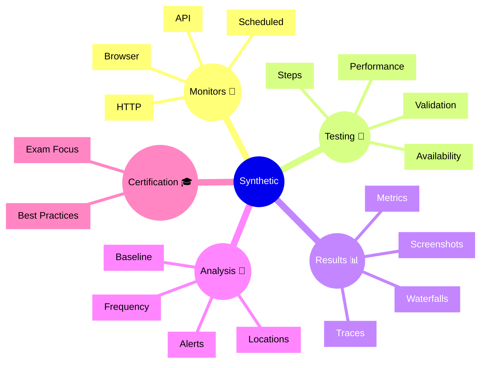

# Dynatrace Synthetic

## Overview

The Dynatrace Synthetic app enables automated testing of applications through browser and API monitors. For the DynaTrace Associate certification, this app is important because it shows how to proactively detect performance issues before real users are affected.

## Synthetic Mindmap

## Key Concepts

- **Synthetic Monitor**: An automated test that simulates user interactions or API calls.
- **Browser Monitor**: A test that uses a browser to simulate real user workflows.
- **API Monitor**: A test that checks the availability and performance of APIs.
- **Waterfall Chart**: A visualization showing resource load timing and dependencies.
- **Geo-Location**: Testing from different geographical locations to catch regional issues.

## Main Features

### Browser Monitoring
- Records and replays realistic user journeys through web applications.
- Captures browser metrics including page load time and resource timing.
- Runs monitors on a scheduled basis from multiple locations.

### API Monitoring
- Tests REST and SOAP API endpoints for availability and response times.
- Validates response content and status codes.
- Supports authentication and complex API workflows.

### Scheduling and Locations
- Runs tests at regular intervals to ensure consistent availability.
- Executes tests from multiple geographical locations globally.
- Detects regional issues and performance variations.

### Performance Analysis
- Generates waterfalls showing resource load sequence and timing.
- Captures screenshots for visual validation and troubleshooting.
- Provides detailed timing breakdowns for diagnosis.

### Alerting and Notifications
- Alerts when synthetic tests fail or performance degrades.
- Integrates with problems and workflows for automated response.
- Supports escalation policies and team notifications.

### Correlation with Real Users
- Links synthetic test results with real user monitoring data.
- Compares synthetic performance to actual user experience.
- Helps validate that applications perform as expected.

## Typical Uses for the Associate Certification

- Understanding how synthetic monitoring complements real user monitoring.
- Recognizing how Dynatrace detects issues before users are affected.
- Learning how to use synthetic tests for baseline establishment.
- Seeing how synthetic failures trigger alerts and workflows.
- Understanding the role of geo-distributed testing.

## Exam-Relevant Focus

- Know the difference between browser and API synthetic monitors.
- Understand why synthetic testing is important for SLOs and availability.
- Be able to explain how synthetic tests provide proactive monitoring.
- Recognize that synthetic metrics can be used in alerts and SLOs.
- Remember that synthetic results integrate with real user monitoring.

## Best Practices

- Create synthetic monitors for critical user journeys and APIs.
- Use multiple locations to detect regional performance issues.
- Correlate synthetic test failures with backend services.
- Establish baselines from synthetic results for trend comparison.
- Keep synthetic test scenarios aligned with real user workflows.

## Summary

Dynatrace Synthetic provides proactive application monitoring through automated browser and API tests. For Associate certification, it demonstrates how synthetic testing complements real user monitoring and enables availability and performance SLOs.
