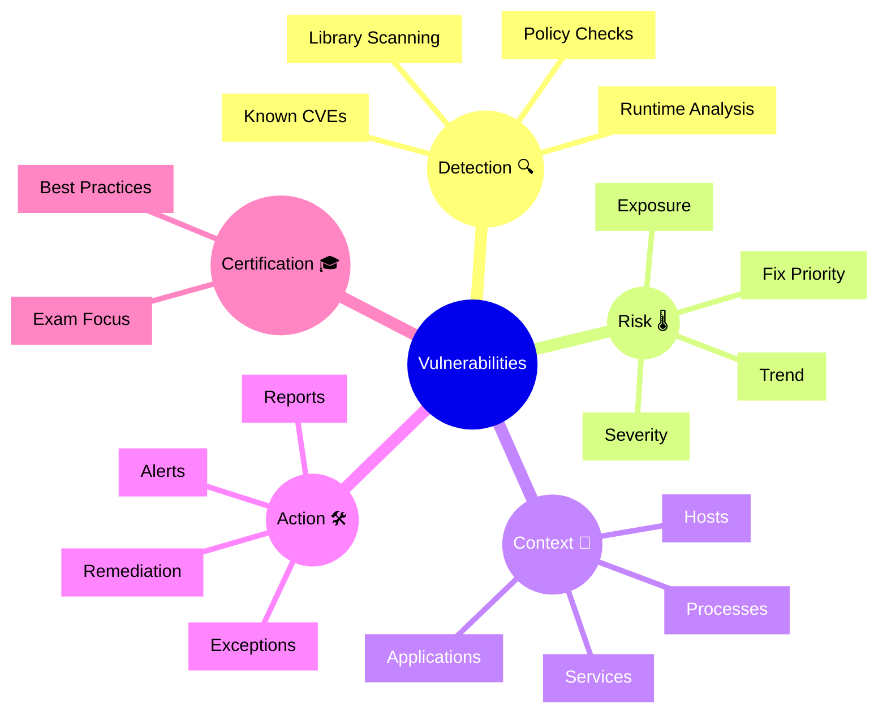

# Dynatrace Vulnerabilities

## Overview

The Dynatrace Vulnerabilities app surfaces software vulnerabilities detected in applications, libraries, and components. In the DynaTrace Associate certification context, this app is important because it shows how Dynatrace identifies risk in deployed software and links vulnerabilities to runtime impact.

## Vulnerabilities Mindmap

## Key Concepts

- **Vulnerabilities**: Security flaws found in code, libraries, or configurations that may be exploitable.
- **CVE**: A publicly known vulnerability identifier used to track security issues.
- **Severity**: A measure of how critical a vulnerability is, often based on CVSS and exploitability.
- **Runtime Exposure**: Whether the vulnerability exists in an actively running process or service.
- **Fix Priority**: The combined risk measure that helps teams decide which vulnerabilities to remediate first.

## Main Features

### Vulnerability Detection
- Detects software vulnerabilities in open-source libraries and custom code.
- Uses runtime scanning and metadata to identify vulnerable components.
- Maps CVEs and severity levels to actual deployed entities.

### Risk and Exposure
- Shows how vulnerabilities affect services, processes, and applications.
- Highlights exposure based on runtime presence and usage.
- Supports prioritization by impact and severity.

### Contextual Linkage
- Connects vulnerability findings to the application topology.
- Helps understand which services or processes are affected by a vulnerable library.
- Enables faster remediation by linking issue to runtime context.

### Reporting and Alerts
- Provides dashboards and reports for vulnerability status.
- Supports alerts for new or critical vulnerabilities.
- Enables tracking of remediation progress.

## Typical Uses for the Associate Certification

- Understanding how Dynatrace discovers vulnerabilities in running environments.
- Learning how vulnerability severity and exposure affect remediation priorities.
- Seeing how vulnerabilities map to services, hosts, and processes.
- Recognizing the difference between static findings and runtime impact.

## Exam-Relevant Focus

- Know that Vulnerabilities app focuses on CVEs, library risk, and runtime exposure.
- Understand how severity, fix priority, and affected entities are presented.
- Be able to explain why vulnerability context is important for remediation.
- Remember that Dynatrace links vulnerabilities to actual deployed instances.

## Best Practices

- Review vulnerability dashboards regularly for new or critical issues.
- Focus remediation on vulnerabilities with high runtime exposure and service impact.
- Use the Vulnerabilities app together with problem and service context.
- Track remediation progress and suppress known exceptions with documented rationale.

## Summary

The Dynatrace Vulnerabilities app is a security-focused tool that identifies and prioritizes software risk in production environments. For Associate certification, it highlights how Dynatrace combines vulnerability detection with runtime context and remediation support.
