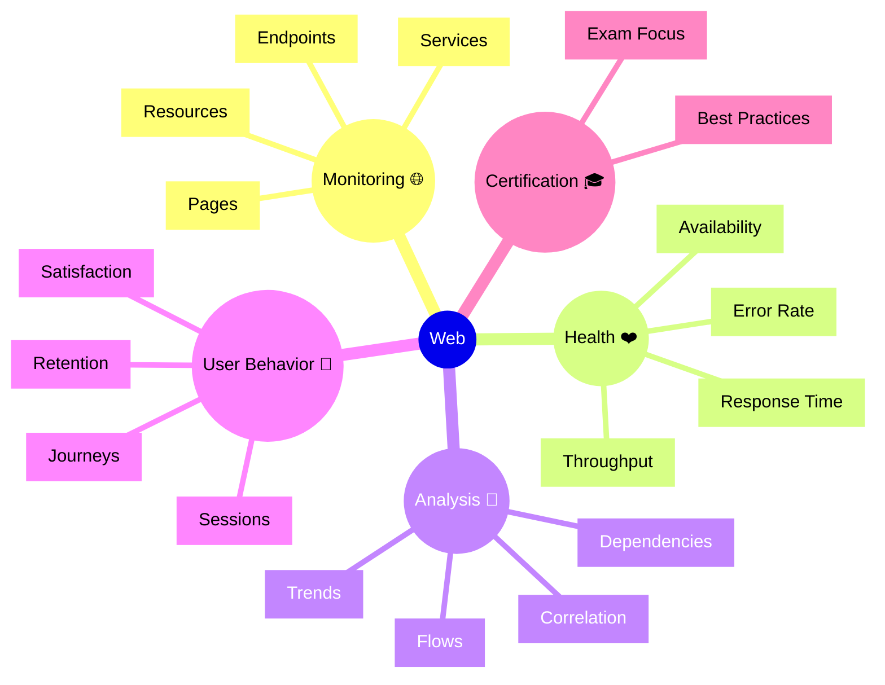

# Dynatrace Web

## Overview

The Dynatrace Web app monitors and analyzes web application performance and user behavior. For the DynaTrace Associate certification, this app is important because it provides comprehensive web application monitoring across multiple layers.

## Web Mindmap

## Key Concepts

- **Web Application**: A software application accessed through a web browser.
- **Endpoint**: A specific URL or API path that handles requests.
- **Web Page**: A resource served to the browser for user interaction.
- **Web Service**: A backend service that supports web application functionality.
- **Core Web Vitals**: Metrics like LCP, CLS, and INP that indicate page loading quality, visual stability, and responsiveness.
- **User Journey**: The path a user takes through pages and interactions in a web app.

## Main Features

### Web Application Monitoring
- Monitors web pages, endpoints, and services supporting the application.
- Tracks availability, response time, and error rates.
- Measures throughput and request volumes.

### Page and Endpoint Analysis
- Analyzes individual pages and endpoints for performance.
- Identifies slow or failing pages and API endpoints.
- Tracks performance trends over time.

### User Session Tracking
- Records user interactions and session flows.
- Enables session replay and detailed behavior analysis.
- Tracks user journeys from entry to conversion.

### Dependency Mapping
- Shows how web pages and endpoints depend on backend services.
- Identifies cascading failures between web tier and services.
- Helps root cause analysis by showing full request paths.

### Error and Exception Tracking
- Captures client-side and server-side errors.
- Groups errors by type and frequency.
- Links errors to affected user populations.

### Performance Correlation
- Links web performance to backend service metrics.
- Correlates page load issues with service response times.
- Includes Core Web Vitals in web performance analysis to correlate user experience with backend behavior.
- Shows the full impact chain from user to infrastructure.

## Typical Uses for the Associate Certification

- Understanding how Dynatrace monitors web applications.
- Recognizing key web performance metrics and user impact.
- Learning how to analyze web page performance and availability.
- Seeing how web data correlates with backend services.
- Understanding the role of web monitoring in digital experience.

## Exam-Relevant Focus

- Know that Web app monitors pages, endpoints, and services.
- Understand the relationship between web metrics and user satisfaction.
- Be able to explain how web monitoring supports SLOs.
- Know how Core Web Vitals such as LCP, CLS, and INP contribute to web experience quality.
- Recognize that web issues often have service-side root causes.
- Remember that web data feeds into overall business metrics.

## Best Practices

- Monitor critical web pages and endpoints for availability and performance.
- Set realistic performance targets based on user expectations.
- Correlate web issues with backend services for faster root cause analysis.
- Use web data to establish and validate SLOs.
- Track user satisfaction alongside technical metrics.
- Add Core Web Vitals to your monitoring mix to capture page load, stability, and responsiveness problems.

## Related Links
- [Core Web Vitals overview](https://web.dev/vitals/)
- [Largest Contentful Paint (LCP)](https://web.dev/lcp/)
- [Cumulative Layout Shift (CLS)](https://web.dev/cls/)
- [Interaction to Next Paint (INP)](https://web.dev/inp/)

## Summary

Dynatrace Web provides comprehensive web application monitoring across pages, endpoints, and user sessions. For Associate certification, it demonstrates how web monitoring integrates with service monitoring to provide end-to-end application observability.
