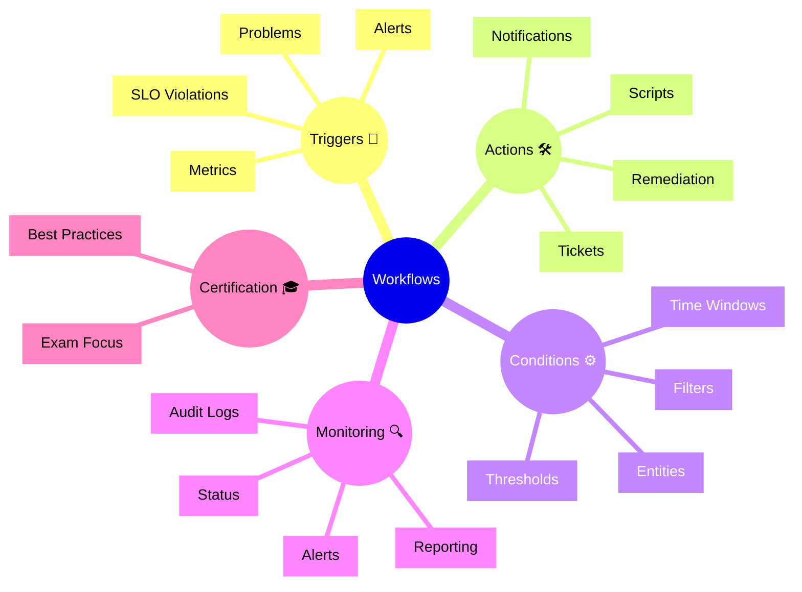

# Dynatrace Workflows

## Overview

Dynatrace Workflows allow automation and operational response for observability events. In the DynaTrace Associate certification context, this app is important because it demonstrates how alerts and problems can trigger defined actions and remediation processes.

## Workflows Mindmap

## Key Concepts

- **Workflows**: Automated sequences that respond to Dynatrace observations.
- **Trigger**: An event or condition that starts a workflow.
- **Action**: A notification, ticket, script, or remediation step executed by the workflow.
- **Condition**: Filters and thresholds that determine when a workflow runs.
- **Audit**: The record of workflow execution and outcomes.

## Main Features

### Automated Response
- Runs actions automatically when alerts or problems occur.
- Enables rapid response to operational incidents.
- Supports notifications, tickets, scripts, and external integrations.

### Trigger Configuration
- Triggers workflows using alerts, problems, metrics, or SLO violations.
- Uses conditions and filters to scope workflow execution.
- Supports time windows and entity-specific criteria.

### Action Management
- Sends notifications to teams or systems.
- Creates incident tickets or triggers remediation scripts.
- Integrates with external platforms for response orchestration.

### Monitoring and Audit
- Records workflow executions and outcomes.
- Helps track whether responses occurred as expected.
- Enables tuning of workflow triggers and actions.

## Typical Uses for the Associate Certification

- Understanding how automated actions can support observability.
- Recognizing when to use workflows for alert response.
- Learning the difference between triggers, conditions, and actions.
- Seeing how workflow auditing helps maintain operational confidence.

## Exam-Relevant Focus

- Know that Workflows automate responses to problems and alerts.
- Understand the components of a workflow: trigger, action, condition.
- Be able to explain why workflows reduce time to response.
- Remember that workflow audit logs help verify execution.

## Best Practices

- Use workflows for repeatable incident response actions.
- Keep triggers precise to avoid unnecessary automation.
- Review audit logs to confirm workflows executed correctly.
- Tune conditions and time windows to reduce noise.

## Summary

Dynatrace Workflows enable automated operational responses to observability events. For Associate certification, they illustrate how actions can be applied consistently and safely in response to alerts and problems.
