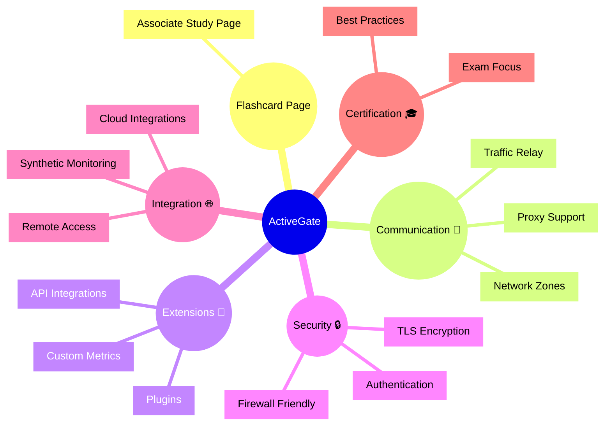

# Dynatrace ActiveGate Flashcards

## Flashcards for DynaTrace Associate Certification

### Dynatrace ActiveGate Mindmap

### Q: What is ActiveGate? 🛡️
A: A Dynatrace gateway component that enables secure communication, proxy support, and extension hosting between OneAgents and the Dynatrace cluster.

### Q: Why is ActiveGate important for certification? 🎓
A: It shows how Dynatrace reaches remote and restricted environments while supporting hybrid, proxy, and firewall-friendly monitoring.

### Q: What is a network zone in ActiveGate? 🌐
A: A logical grouping of entities that use ActiveGate to communicate across network boundaries.

### Q: How does ActiveGate support extensions? 🔌
A: It hosts custom ActiveGate extensions for API integration, custom metrics, and third-party system monitoring.

### Q: What connectivity features does ActiveGate provide? 🔄
A: Traffic relay, proxy support, firewall traversal, and secure TLS-encrypted communication.

### Q: What is a key best practice for ActiveGate? ✅
A: Deploy ActiveGate in each isolated segment that needs Dynatrace access and monitor its health and availability.
