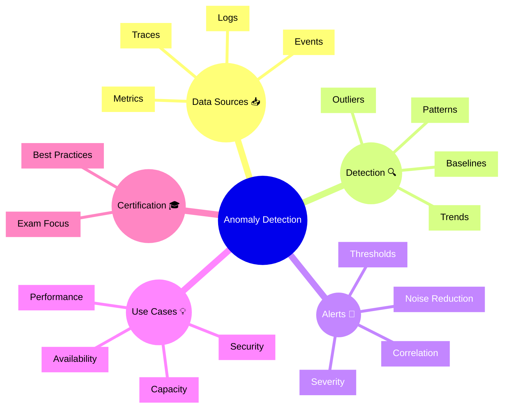

# Dynatrace Anomaly Detection Flashcards

## Flashcards for DynaTrace Associate Certification

### Dynatrace Anomaly Detection Mindmap

### Q: What is anomaly detection in Dynatrace? 🌟
A: Automatic detection of unusual behavior in metrics, logs, events, or traces using learned baselines.

### Q: Why is anomaly detection important for certification? 🎓
A: It shows how Dynatrace finds problems proactively without relying only on fixed thresholds.

### Q: What is a baseline? 📈
A: The normal behavior pattern learned from historical data.

### Q: What is an outlier? 🚩
A: A data point or pattern that deviates significantly from the baseline.

### Q: How does Dynatrace reduce noise in anomaly detection? 🔇
A: By using statistical models and correlation to avoid false alerts.

### Q: What data sources can anomalies come from? 🔌
A: Metrics, logs, events, and traces.

### Q: How does anomaly detection relate to alerts and problems? 🚨
A: Anomalies can trigger alerts or feed into problems with correlated context.

### Q: What is a practical use case? 🧩
A: Detecting sudden CPU spikes, unusual error bursts, or traffic pattern changes.

### Q: What is a best practice for anomaly detection? ✅
A: Monitor anomaly trends and tune sensitivity to balance detection with noise reduction.

### Q: What is the exam takeaway? 📘
A: Remember that Dynatrace uses learned baselines to detect deviations across observability data.
