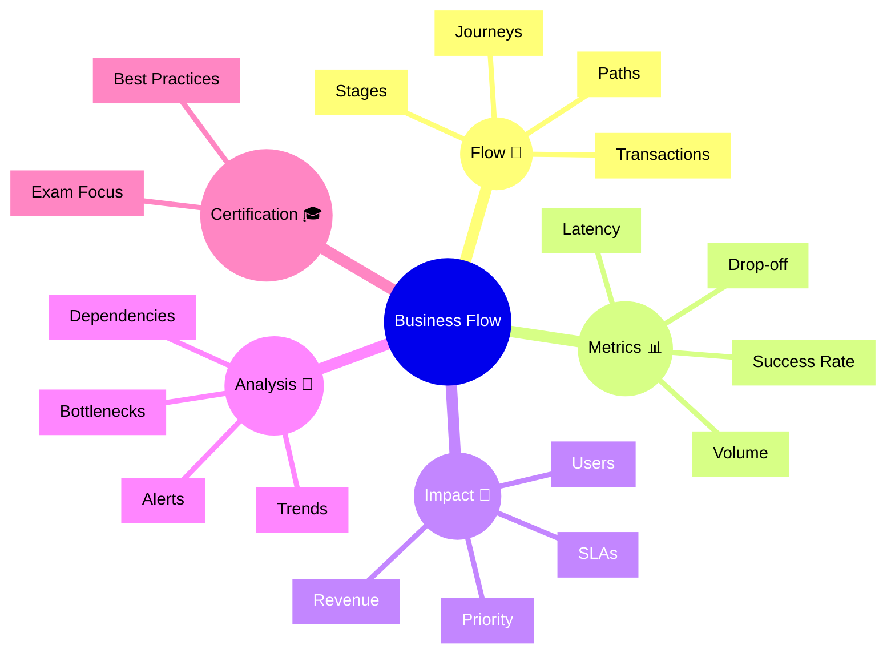

# Dynatrace Business Flow Flashcards

## Flashcards for DynaTrace Associate Certification

### Dynatrace Business Flow Mindmap

### Q: What is the Business Flow app? 🗺️
A: It visualizes business transactions and user journeys to show how key flows move through services and systems.

### Q: Why is Business Flow useful for certification? 🎓
A: It links technical observability to business impact and helps prioritize issues that matter most.

### Q: What is drop-off in Business Flow? 🚪
A: The point where users or transactions abandon the flow, indicating a problem in the journey.

### Q: What does success rate show? ✅
A: The percentage of business transactions that complete successfully.

### Q: How is business flow different from service flow? 🌐
A: Business flow focuses on customer journeys and transactions, while service flow shows service-to-service dependencies.

### Q: What is a key metric in Business Flow? 📊
A: Latency, transaction volume, drop-off rate, and business success metrics.

### Q: What is the role of impact analysis? 📍
A: To show which business flows and users are affected by performance problems.

### Q: What should Associate candidates remember about flow visualization? 👁️
A: It helps identify which stages of a business journey are slow or failing.

### Q: What is a best practice when using Business Flow? ✅
A: Use it to align observability findings with customer and business outcomes.

### Q: How do alerts connect to Business Flow? 🚨
A: They can notify teams when important transaction paths degrade or drop off.
