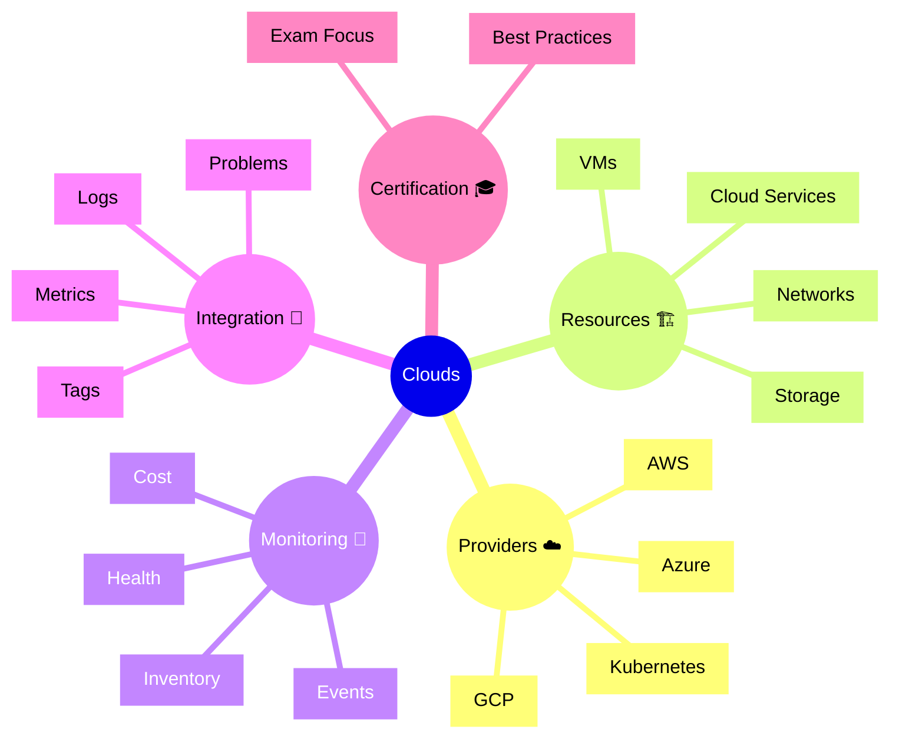

# Dynatrace Clouds Flashcards

## Flashcards for DynaTrace Associate Certification

### Dynatrace Clouds Mindmap

### Q: What does the Clouds app monitor? 🌥️
A: It monitors cloud provider resources, inventory, health, and events across AWS, Azure, GCP, and Kubernetes.

### Q: Why is Clouds relevant for Associate certification? 📘
A: It shows how Dynatrace extends observability from applications to cloud infrastructure and provider services.

### Q: What types of cloud resources can Dynatrace discover? 🔍
A: Virtual machines, storage, network components, managed services, and container workloads.

### Q: What is cloud inventory tracking? 🧾
A: A record of discovered cloud entities and their current state, metadata, and relationships.

### Q: How does Dynatrace show cloud health? ❤️
A: By surfacing provider-specific status, performance metrics, and problems for cloud resources.

### Q: Why are cloud tags useful? 🏷️
A: Tags group resources by team, environment, or application so you can filter and manage cloud entities.

### Q: What is an example of cloud event monitoring? 📢
A: Activity such as instance creation, scaling events, or provider outages that affect monitored services.

### Q: What is a key exam point for the Clouds app? 🎓
A: Understand that Dynatrace can correlate cloud provider data with service and application observability.

### Q: How does cloud monitoring support troubleshooting? 🧰
A: It helps trace issues from provider resources to applications and services that depend on them.

### Q: What are best practices for cloud observability? ✅
A: Keep cloud integrations enabled, use tags for organization, and link cloud problems with service impact.
