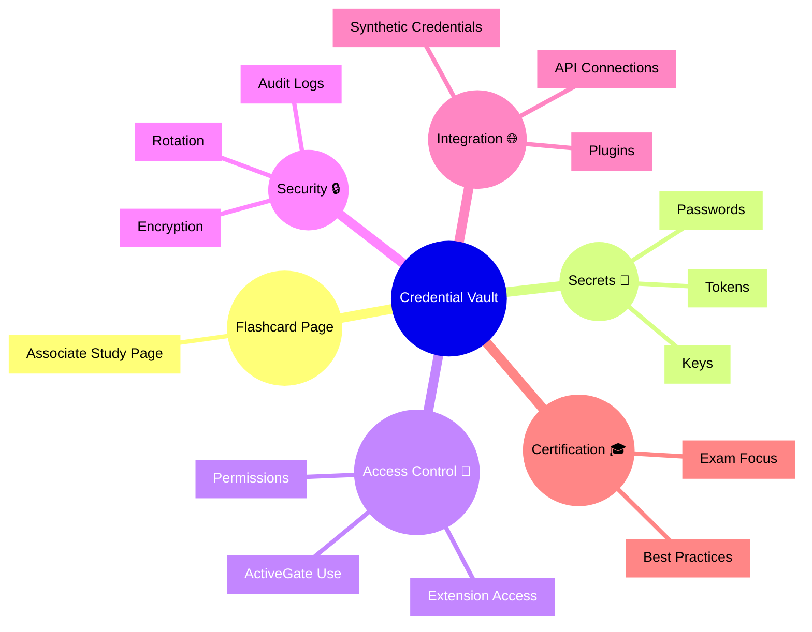

# Dynatrace Credential Vault Flashcards

## Flashcards for DynaTrace Associate Certification

### Dynatrace Credential Vault Mindmap

### Q: What is Credential Vault? 🧾
A: Secure storage for secrets and credentials used by Dynatrace extensions, ActiveGate components, and integrations.

### Q: Why is Credential Vault important for certification? 🎓
A: It emphasizes secure observability practices by protecting sensitive credentials used in monitoring and integrations.

### Q: What types of secrets does Credential Vault store? 🔐
A: Passwords, keys, tokens, and other sensitive integration credentials.

### Q: How do extensions use Credential Vault? 🧩
A: They retrieve credentials securely without exposing raw secrets in configuration or code.

### Q: What security features does Credential Vault provide? 🔒
A: Encryption, audit logging, and support for credential rotation.

### Q: What is a best practice for Credential Vault? ✅
A: Store extension and integration secrets in the vault, audit access, and rotate credentials regularly.
