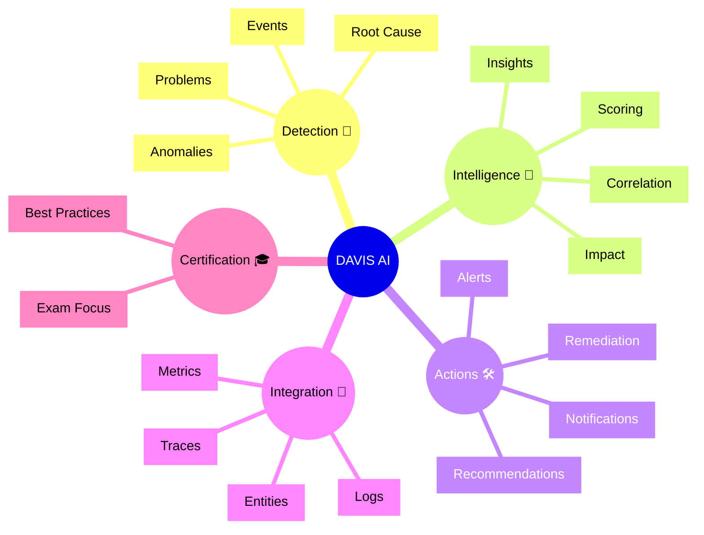

# Dynatrace DAVIS AI Flashcards

## Flashcards for DynaTrace Associate Certification

### Dynatrace DAVIS AI Mindmap

### Q: What is Dynatrace DAVIS AI? 🧠
A: The AI engine in Dynatrace that detects anomalies, creates problems, and identifies root causes using correlation across data.

### Q: Why is DAVIS AI important for certification? 🎓
A: It represents Dynatrace's automated intelligence layer, which is central to observability and incident detection.

### Q: What types of insights does DAVIS AI provide? 💡
A: It provides incident detection, impact analysis, root cause identification, and recommended actions.

### Q: How does DAVIS AI reduce noise? 🔕
A: By correlating related events and metrics, it groups them into meaningful problems rather than many individual alerts.

### Q: What does root cause analysis mean in DAVIS? 🔍
A: The process of finding the most likely source of a detected issue within the monitored environment.

### Q: What is a problem in Dynatrace AI context? 🚨
A: A detected issue that combines multiple symptoms and impacts into a single actionable item.

### Q: How does DAVIS AI use impact analysis? 📊
A: It measures which services and entities are affected and prioritizes issues by user or business impact.

### Q: What should Associate candidates remember about correlation? 🔗
A: DAVIS AI links metrics, logs, traces, and events to provide context for each detected problem.

### Q: What is a best practice when using DAVIS AI? ✅
A: Review AI findings and use the provided context to verify the root cause and remediation path.

### Q: How does DAVIS AI support faster resolution? ⚡
A: By surfacing the most relevant entities and probable causes, it speeds investigation and reduces mean time to repair.
