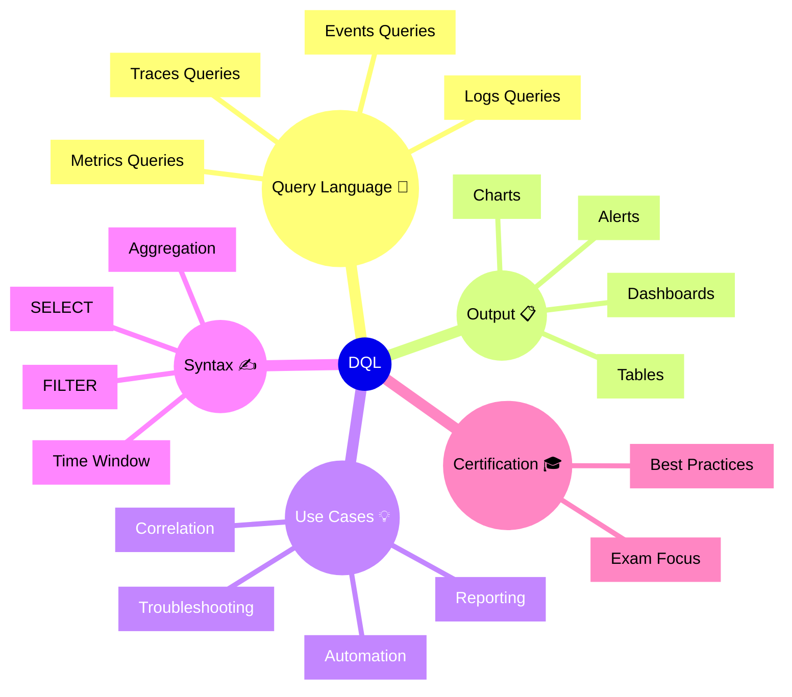

# Dynatrace DQL Flashcards

## Flashcards for DynaTrace Associate Certification

### Dynatrace DQL Mindmap

### Q: What is DQL in Dynatrace? 🧪
A: Dynatrace Query Language used to query metrics, logs, traces, and events from Dynatrace observability data.

### Q: Why is DQL important for Associate certification? 🎓
A: It shows how to explore data beyond default dashboards and build custom analytics for troubleshooting.

### Q: What does DQL allow you to do? 🔧
A: Filter, aggregate, correlate, and visualize observability data from multiple sources.

### Q: What are common DQL query components? 📐
A: SELECT, FILTER, GROUP BY, LIMIT, and aggregation functions.

### Q: What is a typical DQL use case? 🧭
A: Investigating a service incident by querying related logs, metrics, and traces.

### Q: How does DQL support dashboards? 📊
A: You can embed query results into custom dashboard tiles and notebook charts.

### Q: What is the benefit of DQL alerts? 🚨
A: You can create precise alert conditions based on query results and complex data patterns.

### Q: What should you remember about DQL and correlation? 🔗
A: DQL helps link related observability data and find root cause across different event types.

### Q: What is a best practice for query building? ✅
A: Start with narrow filters, add aggregation, and verify results before using them in dashboards or alerts.

### Q: What is an important exam takeaway? 📘
A: Know that DQL is the query engine for advanced data exploration and cross-data correlation in Dynatrace.
