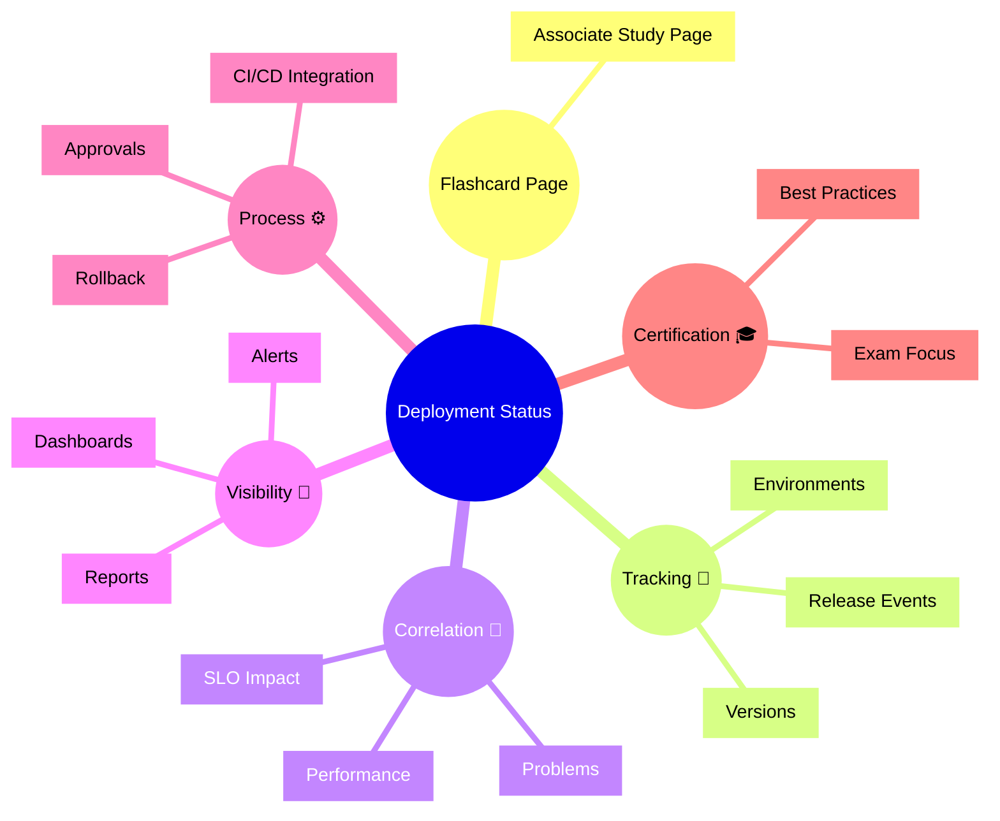

# Dynatrace Deployment Status Flashcards

## Flashcards for DynaTrace Associate Certification

### Dynatrace Deployment Status Mindmap

### Q: What is Deployment Status? 🚢
A: A Dynatrace component that tracks releases, deployment events, and the impact of application changes on performance and problems.

### Q: Why is Deployment Status important for certification? 🎓
A: It links releases to observability data, helping you understand how deployments affect service health and incident investigation.

### Q: What does Deployment Status correlate? 🔗
A: Deployments with problems, performance shifts, and service-level objective impact.

### Q: How does Deployment Status help with CI/CD? 🧪
A: It ingests release metadata from deployment pipelines to connect code versions with observed behavior.

### Q: What visibility does Deployment Status provide? 👀
A: Dashboards, alerts, and reports that display release health, successful/failed deployments, and deployment trends.

### Q: What is a best practice for Deployment Status? ✅
A: Track deployments for key applications and validate whether new releases introduced regressions or improvements.
